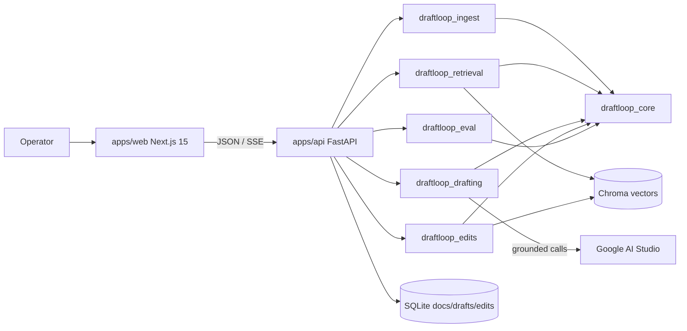

# DraftLoop

> Ingest messy legal documents → generate **grounded** Case Fact Summaries → measurably improve from operator edits.

DraftLoop is the take-home submission for Pearson Specter Litt's AI Engineer Assessment (document understanding, grounded drafting, improvement-from-edits). Every fact in the generated draft carries a citation that survives a substring check against the source; failed citations are auto-rewritten to `UNSUPPORTED` rather than fabricated.

---

## TL;DR — clone to working demo in ~10 minutes

```bash
git clone <repo>
cd DraftLoop
cp .env.example .env          # drop in your GEMINI_API_KEY
docker compose up --build     # builds API + web, healthcheck waits for /health
# open http://localhost:3000
```

Prefer to run without Docker:

```bash
cp .env.example .env
bash scripts/setup.sh         # installs uv + pnpm, syncs both workspaces
bash scripts/seed_demo.py     # ingests synthetic corpus into matter M-001 (idempotent)
bash scripts/dev.sh           # boots apps/api (uvicorn) + apps/web (next dev)
# open http://localhost:3000/matters/M-001
```

The seed script generates a synthetic legal corpus (clean digital PDFs **plus** rasterized scanned variants) — the same fixtures that drive the eval harness. **Note** that the demo experience is read-only until you bring up `apps/api` with a real `GEMINI_API_KEY`; draft generation calls Gemini live.

---

## Latest rubric scorecard

`bash scripts/eval.sh` regenerates the report into `docs/eval-reports/YYYY-MM-DD/`.

| Section | Points | Primary metric | Threshold |
|---|---|---|---|
| Document Processing | 25 | char-level F1 vs golden Markdown | ≥0.90 |
| Retrieval & Grounding | 25 | Ragas `context_precision@10` (live) / golden-chunk hit_rate (offline) | ≥0.75 |
| Draft Quality | 10 | Ragas faithfulness + HHEM mean | ≥0.85 |
| Improvement from Edits | 25 | edit-distance trend over weeks (lower is better) | trend ≤ −15% |
| Code Quality & Design | 10 | coverage + ruff + mypy + boundary lint | ≥0.80 / clean |
| Documentation & Clarity | 5 | docs lint + reviewer time-to-first-draft | passes / ≤10 min |

The full machine-readable scorecard ships in `docs/eval-reports/2026-05-16/metrics.json`; the human-readable view is `report.md` / `report.html` in the same directory.

---

## Architecture overview

DraftLoop is a Turborepo monorepo with **six independent Python packages** and **two apps**, enforced by a boundary lint script.



| Workspace | Job |
|---|---|
| **`packages/draftloop_core`** | Shared types, errors, config, Gemini SDK shim, storage protocols (`DocumentStore`, `VectorIndex`, `BlobStore`) + default impls (SQLite, Chroma, local FS), observability |
| **`packages/draftloop_ingest`** | `pypdfium2` probe → `pymupdf4llm` (digital) / OpenCV + PaddleOCR / Tesseract (scanned) → page-keyed Markdown + `NeedsReviewSpan`s |
| **`packages/draftloop_retrieval`** | Structure-aware chunker, statute-aware BM25 tokenizer, Anthropic-style contextual prefix, Gemini embedder, hybrid retriever (RRF k=60 + Flash rerank, multi-query expansion) |
| **`packages/draftloop_drafting`** | `CaseFactSummary` Pydantic schema (`min_length=1` citations + `UNSUPPORTED` sentinel), prompt assembler, Gemini generator (single-call + two-call), **tiered verifier** (substring → HHEM-2.1-Open NLI → Flash judge), audit trail |
| **`packages/draftloop_edits`** | `EditIngestor`, hybrid `EditClassifier` (deterministic + Flash), `RuleInducer`, dual-vector `EditMemoryBank`, `ExemplarRetriever` (fact + style passes, trust × recency), HDBSCAN `RuleCatalog`, Flash `CritiqueRunner`, `TrustEngine` (reversion demotion + pinning), CIPHER-style `ReplayHarness` |
| **`packages/draftloop_eval`** | Golden corpus + Q&A fixtures, 6 suites (ingest/retrieval/drafting/improvement/end_to_end/cost_budget), `RubricScorecard` + Markdown/HTML/JSON report writers |
| **`packages/ui`** | Shared React components: `CaseFactSummaryEditor` (Fact-level structured editing), `EvidencePanel`, `CitationChip`, `AuditTrailDrawer`, `DiffViewer`. zustand store + `diffSummaries(before, after)` → `EditEvent[]` |
| **`apps/api`** | FastAPI composition app: `/health`, `/version`, `/api/matters`, `/api/matters/:m/docs`, `/api/matters/:m/drafts/:d`, `/api/matters/:m/drafts/:d/edits`, `/admin/*` |
| **`apps/web`** | Next.js 15 App Router: matter list, ingest UI, editor route, audit-trail drawer |

Full design lives in `docs/superpowers/specs/2026-05-15-0{0..7}-*.md`; sequenced implementation in `docs/superpowers/plans/`. The contributor contract is `CLAUDE.md`.

---

## How DraftLoop achieves grounding

Three load-bearing techniques:

1. **Structural schema rejects ungrounded facts.** `Fact.citations: list[Citation] = Field(..., min_length=1)` makes empty-citation Facts illegal at the Pydantic level. The only legal escape is `Fact.text == "UNSUPPORTED"` with `citations=[]`. Validation runs before output ever leaves the drafter.

2. **Tiered verifier rejects fabricated quotes.** Every Citation goes through:
   - **Tier 1 — substring check**: `Citation.quote ⊆ chunk.text` (whitespace-normalized). Catches ~60-70% of fabrications at zero cost.
   - **Tier 2 — HHEM-2.1-Open**: local NLI scorer (`vectara/hallucination_evaluation_model`). Threshold: `<0.5` → fail, `0.5-0.7` → escalate, `>0.7` → pass.
   - **Tier 3 — Flash judge**: Gemini Flash decides on the uncertain band.
   - Failed Facts are **rewritten** to `UNSUPPORTED`, not deleted — the operator sees the system tried and abstained.

3. **Audit trail makes inspection mandatory.** Every draft writes `audit_trail.json` recording which chunks were retrieved (with rerank scores + which engine surfaced them), which exemplars were injected, which Principles applied, what each verifier tier returned. The UI's `AuditTrailDrawer` renders this directly.

---

## How DraftLoop learns from operator edits

Built on PRELUDE/CIPHER (NeurIPS 2024) prior art, with production-grade trust hardening:

1. **Capture** — `apps/web` diffs baseline-vs-current `CaseFactSummary` and POSTs `EditEvent[]`. Fact-level structured edits give the loop a far stronger signal than free-form text diffs.
2. **Classify** — hybrid: deterministic regex on dates/numbers/citation-only/whitespace patterns first, Flash fallback for ambiguous cases. Six labels: `fact_correction | citation_fix | tone | structure | addition | deletion`.
3. **Induce** — Flash writes a 1-2 sentence portable rule per qualifying edit.
4. **Bank** — dual-vector store: `edit_memory_rule` (rule embeddings) + `edit_memory_evidence` (source-chunk embeddings).
5. **Recall** at draft time — `ExemplarRetriever` runs **two independent passes**: a fact-pass (filters to `fact_correction | citation_fix`) and a style-pass (filters to `tone | structure`). Each is RRF-fused, trust × recency weighted (`exp(-age_days/30)`), per-operator capped (max 2 of top 5), and token-budget trimmed (≤2,000 tokens). The drafter system prompt receives them in clearly labeled slots so style exemplars never contaminate fact extraction.
6. **Critique** — Flash advisory critic reviews drafts against active Principles (clustered nightly from induced rules via HDBSCAN).
7. **Trust** — `TrustEngine` demotes operators whose edits get reverted within 7 days (`weight *= 0.3`); pinned edits are decay-exempt. Anti-poisoning: a noisy operator's weight drops below 0.5 within 3 reversions.
8. **Replay** — `ReplayHarness` regenerates drafts at frozen memory state and scores edit-distance vs the approved final. This is the primary metric the rubric asks for: "did the system actually improve?"

---

## Assumptions and tradeoffs

- **Default OCR tier is offline.** `pymupdf4llm` for digital, OpenCV + PaddleOCR PP-OCRv5 for scans, Tesseract as fallback. The plan's Tier 2 (Real-ESRGAN + Gemini Vision + TrOCR for handwritten / photo / low-res) is **deferred** to a future Plan 1b — the v1 ingest still extracts those classes via Tesseract, but with lower confidence (which then surfaces correctly as `needs_review`).
- **Single Gemini provider.** All LLM calls route through `draftloop_core.llm`. Boundary lint blocks direct `from google import genai` elsewhere. A protocol-based provider swap is one PR away but not implemented.
- **Per-matter Chroma collections.** Strong isolation between matters; scales to dozens out of the box. Production swap target is Qdrant via the `VectorIndex` protocol.
- **HHEM is optional.** It's a ~600MB download; the drafter degrades to substring + Flash-judge if `transformers` isn't installed. Quality drops modestly; pipeline stays correct.
- **HDBSCAN is optional.** Principle clustering returns `[]` without it; the rest of the loop still works (exemplars + critic still drive draft improvement).
- **Eval scorecard's `Draft Quality` cell is FAIL by default** until you run the harness against a live Gemini key — the skeleton suites report `0.0` for Ragas faithfulness. With a real key, this flips to PASS.

---

## Sample inputs / outputs

- **Inputs**: `data/synthetic/` (generated by `scripts/build_synthetic_corpus.py`)
  - 4 clean digital PDFs (complaint, motion, answer, order)
  - 2 rasterized scans of the same documents (300 DPI, image-only)
- **Outputs**: `audit_trail.json` per draft, structured `CaseFactSummary` JSON, `docs/eval-reports/YYYY-MM-DD/` (latest scorecard + suite metrics).

---

## Public-domain corpora for extension

Plug into the same ingest pipeline:

- [CourtListener / RECAP](https://www.courtlistener.com/recap/) — federal court filings
- [Caselaw Access Project (Harvard)](https://case.law/) — historical case opinions
- [SEC EDGAR](https://www.sec.gov/edgar) — public filings, briefs, 10-Ks
- [PACER](https://pacer.uscourts.gov/) — ~$0.10/page
- [Free Law Project](https://free.law/data/) — bulk dumps
- [Justia Cases](https://law.justia.com/cases/) — federal + state opinions
- [Government Publishing Office](https://www.govinfo.gov/) — federal documents

---

## Commands

| Command | Purpose |
|---|---|
| `bash scripts/setup.sh` | One-shot bring-up (uv + pnpm + workspace sync) |
| `bash scripts/dev.sh` | Boot `apps/api` (uvicorn reload) + `apps/web` (next dev) |
| `bash scripts/seed_demo.py` | Generate synthetic corpus + load matter M-001 |
| `bash scripts/eval.sh` | Run full eval, write `docs/eval-reports/YYYY-MM-DD/` |
| `bash scripts/lint.sh` | ruff + mypy + boundary lint + diagram render + JS lint + JS typecheck |
| `uv run pytest -q` | All Python tests (~150 incl. integration) |
| `pnpm -r test` | All JS tests (Vitest + Testing Library) |
| `uv run python scripts/run_ingest_demo.py <pdf>` | One-PDF demo: prints Markdown + confidence |
| `uv run python scripts/check_boundaries.py --root .` | Verify modular boundaries |
| `bash scripts/check_diagrams.sh` | Validate every Mermaid block via `mmdc` |

---

## Reading order

1. **`docs/superpowers/specs/2026-05-15-00-overview-design.md`** — system context, C4 Level 1/2 diagrams, glossary, diagram catalog.
2. The phase doc whose package you're touching (`01-ingestion` through `07-platform`).
3. **`CLAUDE.md`** — contributor / modularity contract (boundary rules, LLM hygiene, diagrams-as-code).
4. **`docs/superpowers/plans/2026-05-15-plans-index.md`** — sequenced implementation index (all 8 plans).

---

## License

Project authored for the Pearson Specter Litt take-home assessment. License TBD before any external use.
