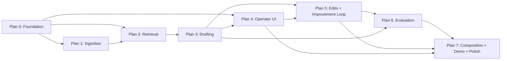

# DraftLoop — Implementation Plans Index

> **For agentic workers:** REQUIRED SUB-SKILL: Use `superpowers:subagent-driven-development` (recommended) or `superpowers:executing-plans` to implement each plan task-by-task.

**Goal:** Sequence the implementation work so each plan produces working, testable software on its own and the dependency graph is explicit.

**Spec source:** `docs/superpowers/specs/2026-05-15-0{0..7}-*-design.md`

---

## Plan sequencing

| Plan | File | Builds | Depends on | Status |
|---|---|---|---|---|
| 0 | `2026-05-15-00-foundation-plan.md`            | Monorepo, `draftloop_core`, `apps/api` skeleton, `apps/web` skeleton, `packages/ui` skeleton, scripts, CI, lint | — | **DONE** (merged to main 2026-05-15) |
| 1 | `2026-05-15-01-ingestion-plan.md`             | `draftloop_ingest` core + digital PDF tier + scanned OCR tier + synthetic corpus (Phase 01 spec) | Plan 0 | **DONE** (merged 2026-05-16) |
| 1b | `2026-05-15-01b-ingestion-hard-cases-plan.md` (future) | Handwritten (Gemini Vision + TrOCR), low-res super-res (Real-ESRGAN), photo perspective correction | Plan 1 | DEFERRED |
| 2 | `2026-05-15-02-retrieval-plan.md`             | `draftloop_retrieval` (Phase 02 spec) | Plans 0, 1 | **DONE** (merged 2026-05-16) |
| 3 | `2026-05-15-03-drafting-plan.md`              | `draftloop_drafting` + HHEM verifier + audit trail (Phase 03 spec) | Plans 0, 2 | **DONE** (merged 2026-05-16) |
| 4 | `2026-05-15-04-operator-ui-plan.md`           | `apps/web` editor + `packages/ui` editor components (Phase 04 spec) | Plans 0, 3 | **DONE** (merged 2026-05-16) |
| 5 | `2026-05-15-05-improvement-loop-plan.md`      | `draftloop_edits` — capture, classifier, memory bank, critic, replay (Phase 05 spec) | Plans 3, 4 | **WRITTEN** |
| 6 | `2026-05-15-06-evaluation-plan.md`            | `draftloop_eval` — Ragas + HHEM + golden corpus + scorecard (Phase 06 spec) | Plans 3, 5 | **WRITTEN** |
| 7 | `2026-05-15-07-composition-demo-plan.md`      | `apps/api` full wiring, seed/demo scripts, Docker compose, README + eval report | All prior | **WRITTEN** |

## Workflow

Plans are written and executed sequentially. After each plan completes and merges to `main`, the next plan is written. This keeps later plans grounded in what was actually built — not in pre-baked guesses that drift from reality.

When a plan completes:

1. Mark this index entry `done`.
2. Run `scripts/eval.sh` (once Plan 6 lands) and link the report from the README.
3. Write the next plan; commit it; resume execution.

## Spec → Plan coverage map

| Spec | Primary plan | Tests live in |
|---|---|---|
| `00-overview-design.md` (glossary, C4 L1/L2) | Plan 0 (assembled) | n/a — overview doc |
| `01-ingestion-design.md` | Plan 1 | `packages/draftloop_ingest/tests/`, `tests/integration/test_ingest.py` |
| `02-retrieval-design.md` | Plan 2 | `packages/draftloop_retrieval/tests/`, `tests/integration/test_retrieval.py` |
| `03-drafting-design.md` | Plan 3 | `packages/draftloop_drafting/tests/`, `tests/integration/test_drafting.py` |
| `04-operator-ui-design.md` | Plan 4 | `packages/ui/tests/`, `apps/web/tests/`, `tests/e2e/test_editor.spec.ts` |
| `05-improvement-loop-design.md` | Plan 5 | `packages/draftloop_edits/tests/`, `tests/integration/test_edit_loop.py` |
| `06-evaluation-design.md` | Plan 6 | `packages/draftloop_eval/tests/`, `tests/integration/test_eval_suites.py` |
| `07-platform-design.md` (test pyramid, deploy, CI) | Plans 0 (substrate) + 7 (compose + demo + report) | `tests/contract/`, `tests/e2e/`, CI workflow file |

## Per-plan execution choice

When a plan is ready to execute, the user is offered two paths:

1. **Subagent-driven (recommended)** — fresh subagent per task with two-stage review between tasks. Best for large plans (Plans 0, 1, 5).
2. **Inline execution** — batched execution with operator checkpoints. Best for tightly coupled work and quick wins (Plans 2, 3 may fit this once Plan 0/1 are in place).

The choice is made plan-by-plan, not globally.
