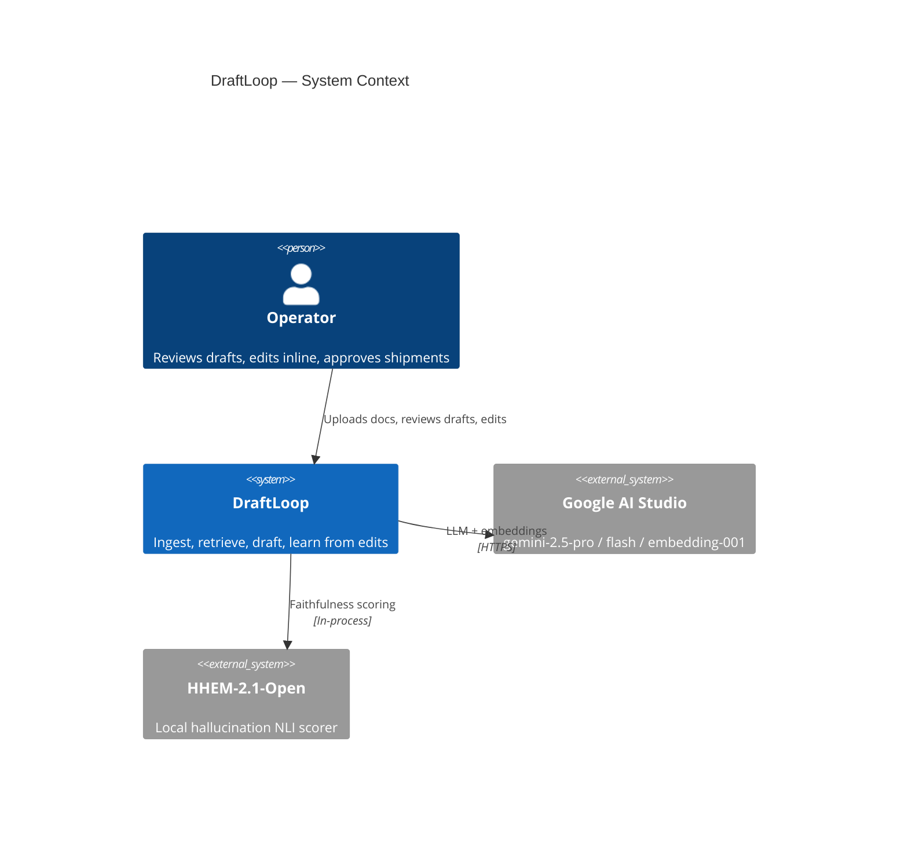
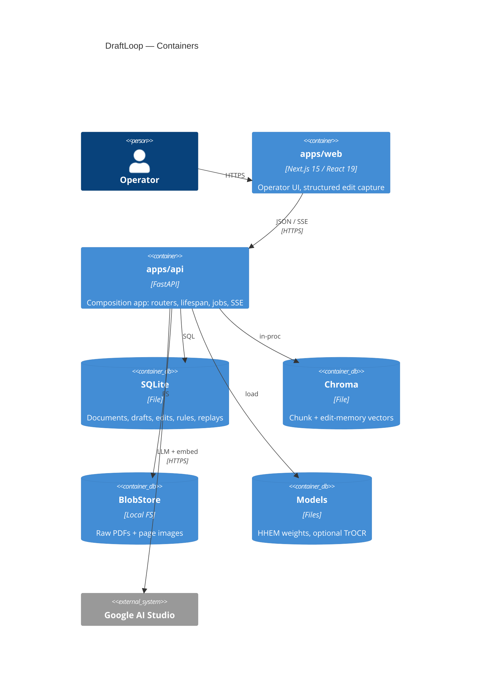
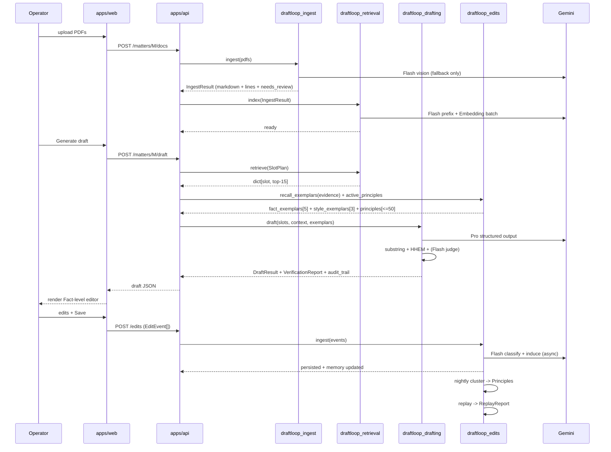

# DraftLoop — Phase 00: System Overview & Architecture

| Field          | Value                                                              |
| -------------- | ------------------------------------------------------------------ |
| Status         | Approved (brainstorming)                                           |
| Owner          | DraftLoop team                                                     |
| Date           | 2026-05-15                                                         |
| Source         | `document/AI Engineer - Assessment.pdf`                            |
| Rubric weight  | All 100 points (composition layer)                                 |

> Each design doc in this directory describes one phase of DraftLoop. Read this
> overview first; it establishes the system context, the package boundaries, and
> the diagram catalog every other phase doc points back into.

## 1. Goal

DraftLoop is an internal workflow for Pearson Specter Litt that:

1. Ingests messy legal-style documents (scanned, low-resolution, handwritten,
   illegible, inconsistently formatted).
2. Extracts clean text + structured fields downstream stages can consume.
3. Retrieves relevant evidence with stable citation anchors.
4. Generates a grounded **Case Fact Summary** — every fact carries ≥1
   citation; abstention is structurally required when evidence is missing.
5. Improves measurably over time by learning from operator edits.

The chosen draft output is the **Case Fact Summary** because it exercises every
input variety, demands real grounding (each fact cites a span), and gives the
evaluation harness clean structured targets.

## 2. System Context (C4 Level 1)



## 3. Containers (C4 Level 2)



## 4. Repo layout

```
draftloop/
├─ apps/
│  ├─ api/                          # FastAPI composition app (thin)
│  │  └─ src/draftloop_api/         # routers, config, lifespan, di
│  └─ web/                          # Next.js 15 App Router
│
├─ packages/
│  ├─ draftloop_core/               # shared types, errors, llm shim, observability
│  ├─ draftloop_ingest/             # PDF probe -> OCR -> markdown -> structured pages
│  ├─ draftloop_retrieval/          # embed, BM25, hybrid, rerank, citation anchors
│  ├─ draftloop_drafting/           # prompt assembly, generation, verifiers, audit
│  ├─ draftloop_edits/              # capture, classify, memory bank, critic, replay
│  ├─ draftloop_eval/               # Ragas + HHEM + held-out replay + reports
│  └─ ui/                           # shared React components (editor, evidence panel)
│
├─ docs/superpowers/specs/          # phased design docs (one MD per phase)
├─ scripts/                         # corpus gen, demo seed, eval runner, ops
├─ tests/                           # cross-package integration + e2e
├─ data/                            # gitignored runtime: pdfs, sqlite, chroma
├─ docker-compose.yml               # one-command bring-up
├─ turbo.json                       # pipeline graph
├─ pyproject.toml                   # uv workspace root
├─ pnpm-workspace.yaml              # pnpm workspace
├─ CLAUDE.md                        # modularity contract
└─ README.md
```

## 5. Architectural decisions (locked)

| # | Decision | Rationale |
|---|----------|-----------|
| 1 | Modular package-per-phase (Approach C) | Reusable across other projects; CLAUDE.md enforces boundaries via lint |
| 2 | Single FastAPI process + BackgroundTasks | No Redis/Celery; reviewer experience trumps throughput at take-home scale |
| 3 | Storage behind three interfaces (`DocumentStore`, `VectorIndex`, `BlobStore`) | Local SQLite/Chroma by default; Postgres/Qdrant/S3 are config swaps |
| 4 | Gemini-only LLM dependency | User-chosen provider; all calls funneled through `draftloop_core.llm` |
| 5 | Span-citation protocol (chunk-ID tags + Pydantic schema + post-validation) | Gemini lacks native user-doc citations; structural schema + verifier substitutes |
| 6 | Edit loop = memory-bank + critic (PRELUDE/CIPHER + Constitutional AI) | Real improvement, not version diff; rubric §4 (25 pts) demands it |
| 7 | Per-matter Chroma collections | Prevents cross-matter retrieval leakage |
| 8 | Diagrams as code (Mermaid in markdown) | Native GitHub render, CI-validated, evolves with code |

## 6. Cross-cutting data flow — happy path



## 7. Diagram catalog

Every phase doc carries Mermaid diagrams. This catalog maps where to look.

| Phase doc | Diagrams it owns |
|---|---|
| `00-overview-design.md` (this file) | C4 L1 Context, C4 L2 Container, cross-cutting sequence |
| `01-ingestion-design.md` | OCR routing flowchart, ingestion state machine, C4 L3 component |
| `02-retrieval-design.md` | Indexing flow, query-time sequence, C4 L3 component, RRF data flow |
| `03-drafting-design.md` | Generation flow, tiered verifier flow, C4 L3 component, audit-trail ER |
| `04-operator-ui-design.md` | Editor flow, editor state machine, edit-capture sequence, C4 L3 |
| `05-improvement-loop-design.md` | Edit lifecycle flow, exemplar retrieval flow, C4 L3, full ER schema |
| `06-evaluation-design.md` | Eval suite sequence, rubric→metric mapping, C4 L3 |
| `07-platform-design.md` | Test pyramid, deployment topology, CI pipeline |

Discipline: any architectural change updates its diagrams in the same PR.
`mermaid-cli` validates every diagram in CI (`scripts/check_diagrams.sh`).

## 8. Glossary

| Term | Meaning |
|---|---|
| Matter | A single litigation/legal engagement; corpus + drafts scoped to it |
| Slot | One field in the Case Fact Summary (parties, jurisdiction, …) — 7 total |
| Fact | One atomic statement under a slot, with sentence_id + citations + confidence |
| Chunk | A retrieval unit: text + char_start/char_end + page + section_label + confidence_min |
| Citation | `(chunk_id, quote)` — quote must be verbatim substring of chunk.text |
| Audit trail | Per-draft JSON recording every chunk, exemplar, principle, verifier verdict |
| Edit event | One operator action against one Fact (or structural change) |
| Induced rule | 1–2 sentence NL rule derived from one classified edit |
| Principle | Cluster-level constitutional rule used by the critic (≤50 active) |
| Trust weight | Per-operator multiplier on exemplar retrieval scores |
| Held-out replay | Regen drafts at time T using memory frozen at T-7d; primary improvement metric |
| HHEM | Vectara hallucination_evaluation_model — local NLI faithfulness scorer |
| Needs-review span | Any ingested span with `confidence < 0.80`; never sole citation |
| UNSUPPORTED | Sentinel `Fact.text` used when evidence is missing/contradictory |

## 9. Public-domain sample corpora (for post-assessment expansion)

The synthetic corpus is the default eval set (deterministic ground truth). For
later expansion against real-world inputs, pull from any of:

- [CourtListener / RECAP](https://www.courtlistener.com/recap/)
- [Caselaw Access Project (Harvard)](https://case.law/)
- [SEC EDGAR](https://www.sec.gov/edgar)
- [PACER](https://pacer.uscourts.gov/) (paid, ~$0.10/page)
- [Free Law Project](https://free.law/data/)
- [Open Casebook (H2O)](https://opencasebook.org/)
- [Justia Cases](https://law.justia.com/cases/)
- [Government Publishing Office](https://www.govinfo.gov/)

`scripts/build_synthetic_corpus.py` generates the canonical 12-doc corpus.
`scripts/import_external_pdf.py` (post-assessment) ingests external PDFs into a
new matter while preserving the eval pipeline against the synthetic golden set.

## 10. Out of scope (this iteration)

- Multi-tenant auth (single in-memory operator session in dev).
- Real-time collaborative editing beyond ETag-gated 3-way merge.
- DSPy / fine-tuning of any model.
- Native non-PDF inputs (DOCX, EML) — design accommodates them via an
  `Ingestor` protocol, not implementing now.
- Production observability (Prometheus, Grafana). OTel stdout exporter only.

## 11. Cross-references

- Phase 01 — Ingestion: `2026-05-15-01-ingestion-design.md`
- Phase 02 — Retrieval: `2026-05-15-02-retrieval-design.md`
- Phase 03 — Drafting: `2026-05-15-03-drafting-design.md`
- Phase 04 — Operator UI: `2026-05-15-04-operator-ui-design.md`
- Phase 05 — Improvement Loop: `2026-05-15-05-improvement-loop-design.md`
- Phase 06 — Evaluation: `2026-05-15-06-evaluation-design.md`
- Phase 07 — Platform / Tooling / Deploy: `2026-05-15-07-platform-design.md`
