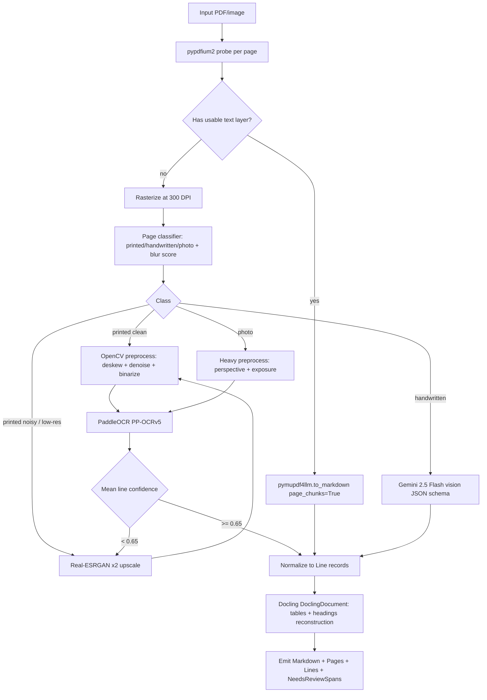
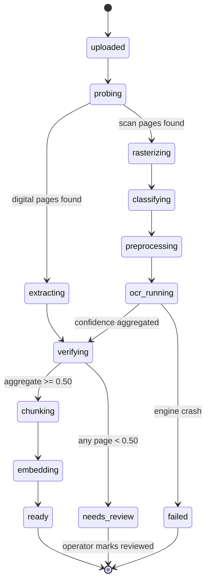
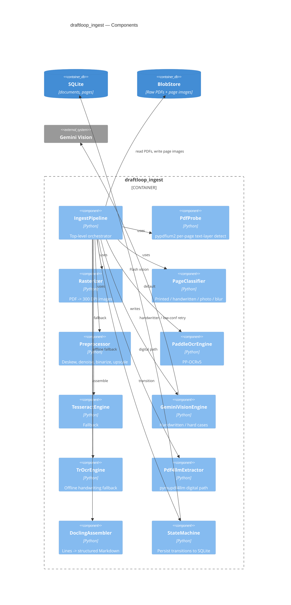

# DraftLoop — Phase 01: Document Ingestion & OCR

| Field         | Value                                            |
| ------------- | ------------------------------------------------ |
| Package       | `packages/draftloop_ingest`                      |
| Rubric weight | §1 Document Processing — 25 points               |
| Depends on    | `draftloop_core` (types, storage, llm shim)      |
| Status        | Approved                                         |

## 1. Goal

Take a path (PDF or image) of arbitrary quality and produce **clean,
page-keyed, structured Markdown + per-line confidence metadata** that the
retrieval layer can chunk without further cleanup. Mark low-confidence
spans so downstream stages know what evidence to treat skeptically.

Input quality classes the pipeline must handle:

- Digital-native PDFs (text layer present)
- Clean scans (printed, 300+ DPI)
- Low-resolution scans (<200 DPI, noisy)
- Handwritten notes
- Photos of filings (skewed, lit unevenly)
- Partially illegible regions (smudges, redactions, torn pages)
- Inconsistently formatted files (mixed pages of multiple classes)

## 2. Public API

```python
# packages/draftloop_ingest/src/draftloop_ingest/__init__.py
from draftloop_ingest.pipeline import IngestPipeline
from draftloop_ingest.types import (
    IngestRequest, IngestResult, Page, Line, Confidence, NeedsReviewSpan
)
```

`IngestPipeline.run(req: IngestRequest) -> IngestResult` is the only entry
point. Internal modules are not importable across the package boundary.

## 3. OCR routing flowchart



## 4. Quality strategy

| Input class | Detection signal | Primary engine | Fallback |
|---|---|---|---|
| Digital-native | `pypdfium2` returns ≥50 chars; bitmap area <50% | `pymupdf4llm` | — |
| Clean scan | Laplacian variance > 100; printed-font classifier | PaddleOCR PP-OCRv5 | Tesseract |
| Low-res / noisy | Laplacian var < 100 OR DPI < 200 | Real-ESRGAN x2 → PaddleOCR | Gemini Vision |
| Handwritten | Stroke-aspect / connected-component classifier flags | Gemini 2.5 Flash vision (JSON: text + confidence + uncertain_spans) | TrOCR-large per line crop |
| Photo of filing | Perspective skew detected, lighting variance high | Perspective-correct → PaddleOCR | Gemini Vision |
| Partially illegible | Per-line confidence < 0.80 post-primary | Retry with upscale; still <0.80 → flag span | Gemini Vision |

Engines bundle via a `OcrEngine` protocol; routing is data-driven via
`config/ocr_routing.yaml` so swaps are config-only.

## 5. Confidence normalization

Every engine emits the same `Line` record:

```python
class Line(BaseModel):
    page: int
    text: str
    bbox: tuple[int, int, int, int]   # x1, y1, x2, y2 in page pixels
    confidence: float                  # 0..1 normalized across engines
    engine: Literal["pymupdf4llm", "paddleocr", "tesseract", "gemini_vision", "trocr"]
    needs_review: bool                 # True iff confidence < 0.80
```

Engine-specific mapping:

- **pymupdf4llm**: digital text gets `confidence=1.0`, `needs_review=False`.
- **PaddleOCR**: `confidence = rec_score`.
- **Tesseract**: `confidence = image_to_data conf / 100`.
- **Gemini Vision**: model returns `confidence` per line in JSON schema.
- **TrOCR**: token probabilities mean → `confidence`.

`Line.needs_review = confidence < 0.80` is invariant — guaranteed by
constructor.

## 6. Ingestion state machine



State persisted in SQLite `documents` table. SSE channel
`/jobs/{id}` streams transitions to the operator UI.

## 7. Public output schema

```python
class Page(BaseModel):
    page: int
    width_px: int
    height_px: int
    dpi: int
    class_: Literal["digital", "clean_scan", "low_res", "handwritten", "photo", "mixed"]
    engines_used: list[str]
    lines: list[Line]
    needs_review: bool

class NeedsReviewSpan(BaseModel):
    page: int
    bbox: tuple[int, int, int, int]
    text: str
    confidence: float
    reason: Literal["low_ocr_conf", "illegible", "blurry", "redacted"]

class IngestResult(BaseModel):
    doc_id: str
    source_path: str
    pages: list[Page]
    markdown: str                              # Docling-reconstructed, with <!-- page=N --> markers
    needs_review_spans: list[NeedsReviewSpan]
    aggregate_confidence: float
    engines_used: dict[int, list[str]]         # page -> engines
    duration_ms: int
    ingest_version: str                        # for cache invalidation downstream
```

The markdown is structure-aware (headings, lists, tables preserved) so the
retrieval layer's structural splitter can rely on heading boundaries.

## 8. Component-level C4



## 9. Synthetic corpus generation

`scripts/build_synthetic_corpus.py` writes a deterministic corpus into
`data/synthetic/`:

| File | Quality class | Generator strategy |
|---|---|---|
| `complaint.pdf`           | digital-native | ReportLab from `templates/complaint.j2` |
| `motion.pdf`              | digital-native | ReportLab from `templates/motion.j2` |
| `answer.pdf`              | digital-native | ReportLab from `templates/answer.j2` |
| `order.pdf`               | digital-native | ReportLab from `templates/order.j2` |
| `complaint_scan.pdf`      | clean scan | Render `complaint.pdf` to 300 DPI image + re-PDF |
| `motion_scan.pdf`         | clean scan | Same as above for motion |
| `answer_lowres.pdf`       | low-res | Re-render at 96 DPI + JPEG-compress |
| `order_lowres.pdf`        | low-res | Same as above for order |
| `attorney_notes.pdf`      | handwritten | Pillow with `handwriting.ttf` |
| `witness_statement.pdf`   | handwritten | Pillow with stroke jitter |
| `filing_photo.pdf`        | photo | Apply perspective transform + lighting gradient to scan |
| `damaged_exhibit.pdf`     | partial illegible | Apply white-noise patches over 15% of text regions |

Golden truth (committed): `data/golden/ingest_truth/<doc_id>.md` +
`<doc_id>_needs_review.json`. Source PDFs are regenerated deterministically
from templates and seed `42`; the golden Markdown is the *committed answer
key* — never regenerated automatically.

## 10. Tests

| Layer | Coverage |
|---|---|
| Unit | Routing logic for each `(blur, text_layer, stroke_aspect)` triple → correct engine pick |
| Unit | Confidence normalization invariant: every engine yields `Line.needs_review == (confidence < 0.80)` |
| Property | For every `Line`, `text` is non-empty when `confidence > 0.50` |
| Property | `IngestResult.markdown` contains `<!-- page=N -->` markers exactly once per emitted page |
| Golden | Each synthetic doc → extracted Markdown matches golden truth within `SequenceMatcher.ratio() >= 0.90` |
| Golden | `NeedsReviewSpan` set has recall ≥ 0.80 on injected illegible regions |
| Integration | End-to-end for each quality class, asserting no engine crashes the pipeline |
| Cost | A full corpus ingest costs $0 (Tier 1 only). Flags any unexpected Gemini Vision firing. |

## 11. Failure modes & mitigation

| Failure | Mitigation |
|---|---|
| pymupdf4llm crashes on malformed PDF | Catch; downgrade to rasterize-and-OCR path |
| PaddleOCR install fails on a reviewer machine | `--no-paddle` mode falls back to Tesseract default |
| Gemini Vision unavailable | Skip Tier-2 handwriting; mark spans `needs_review=True` and surface upstream |
| Real-ESRGAN OOM on a huge page | Catch, retry on CPU, then skip super-res and just mark needs_review |
| HHEM model not yet downloaded (Phase 03) | Ingestion doesn't depend on HHEM; orthogonal failure |
| Document has 500+ pages | Stream pages through a bounded queue (max 8 in-flight); no full-doc materialization |
| Engine emits non-UTF-8 bytes | Normalize via `errors="replace"`; flag the line `needs_review=True` |
| Document is encrypted | Detect via pypdfium2; emit `IngestResult` with `failed=True` and `reason="encrypted"` |

## 12. Public-domain corpora (for post-assessment expansion)

Curated in `docs/superpowers/specs/00-overview-design.md` §9. The same
`IngestPipeline` ingests CourtListener / SEC EDGAR / Justia PDFs unchanged.
`scripts/import_external_pdf.py` wires that up post-assessment.

## 13. Open decisions deferred to implementation

- Per-page engine concurrency cap default value (proposed: `min(4, cpu_count())`).
- Whether Docling table reconstruction is on by default for digital-native pages (proposed: yes).
- TrOCR weight bundling: in image or on first-boot download (proposed: first-boot, with a `--prebake-models` build arg for air-gapped reviewers).

## 14. Cross-references

- Overview: `2026-05-15-00-overview-design.md`
- Downstream consumer: `2026-05-15-02-retrieval-design.md`
