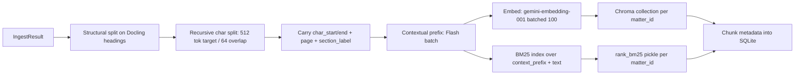
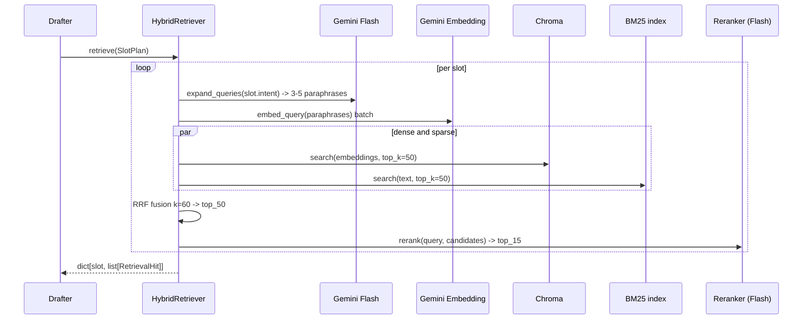
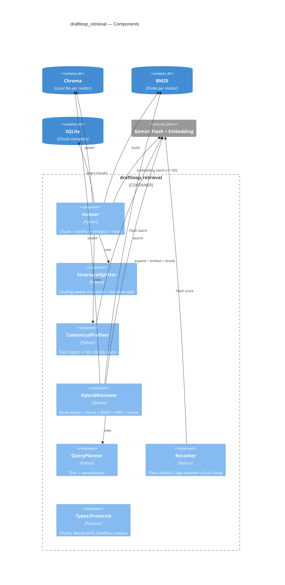

# DraftLoop — Phase 02: Retrieval & Grounding

| Field         | Value                                            |
| ------------- | ------------------------------------------------ |
| Package       | `packages/draftloop_retrieval`                   |
| Rubric weight | §2 Retrieval and Grounding — 25 points (shared)  |
| Depends on    | `draftloop_core`, consumes `IngestResult`        |
| Status        | Approved                                         |

## 1. Goal

Take a clean ingested document set; produce a hybrid (dense + sparse) index
with stable citation anchors; answer slot-shaped queries with **top-15
chunks each carrying `(doc_id, page, char_start, char_end)`** so any cited
quote can be substring-validated against the source.

## 2. Public API

```python
# packages/draftloop_retrieval/src/draftloop_retrieval/__init__.py
from draftloop_retrieval.indexer   import Indexer
from draftloop_retrieval.retriever import HybridRetriever
from draftloop_retrieval.types     import (
    Chunk, RetrievalQuery, RetrievalHit, SlotPlan, Slot,
    VectorIndex, LexicalIndex                       # protocols
)
```

## 3. Chunk model

```python
class Chunk(BaseModel):
    chunk_id: str                # "doc_3_p4_¶12_c_0012" - stable
    doc_id: str
    matter_id: str
    page: int
    section_label: str | None    # "Claims", "Procedural Posture", etc.
    para_id: str | None          # "¶12"
    char_start: int
    char_end: int                # offsets into IngestResult.markdown
    text: str
    context_prefix: str          # 50-100 tok Flash-generated blurb (Anthropic Contextual Retrieval)
    embedding_text: str          # context_prefix + "\n\n" + text  (what gets embedded)
    embedding_dim: int           # 1536 by default (Matryoshka truncate)
    confidence_min: float        # lowest Line.confidence in the underlying span
    contains_needs_review: bool
    ingest_version: str          # for cache invalidation
```

Invariants:

- `Chunk.text == ingest_result.markdown[char_start:char_end]` after
  whitespace-normalize.
- `chunk_id` is stable across re-indexing if `(doc_id, char_start, char_end,
  ingest_version)` is stable.

## 4. Indexing pipeline



### Five load-bearing details

1. **Structure-aware first.** Chunks never cross section boundaries. The
   recursive splitter operates *within* each section.
2. **Anthropic Contextual Retrieval.** Each chunk is prefixed with a 50–100
   token Flash-generated blurb *before* embedding and BM25 indexing.
   Research-validated: drops retrieval failure from 35% → 49%, and to 67%
   with rerank.
3. **Gemini embedding batching.** Hard caps: `batch ≤ 100`, `input ≤ 2048
   tokens per item`. Indexer respects both; uses `asyncio.Semaphore` to
   stay under Tier-1 RPM.
4. **Matryoshka 1536-dim.** Default `output_dimensionality=1536` (truncated
   from native 3072) — half the storage with negligible quality loss for
   our corpus size.
5. **Per-matter Chroma collections.** No cross-matter retrieval leaks.
   SQLite `chunks` table has `(matter_id, doc_id, chunk_id)` index.

## 5. Query-time pipeline (per slot)



## 6. SlotPlan for Case Fact Summary

```python
SLOT_PLAN: list[Slot] = [
    Slot("parties",            "Who are the named parties, roles, and counsel?"),
    Slot("jurisdiction",       "Court, venue, jurisdiction basis, governing law."),
    Slot("key_dates",          "Filing date, incident date, contract date, hearings."),
    Slot("claims",             "Causes of action / counts and against whom."),
    Slot("relief_sought",      "Damages, injunctions, other remedies requested."),
    Slot("procedural_posture", "Current stage: pleading, discovery, motion, trial, appeal."),
    Slot("key_evidence",       "Exhibits, declarations, statements relied on."),
]
```

Per slot:

- **Multi-query expansion.** Flash generates 3–5 paraphrases of the slot
  intent. Each is embedded; results are RRF-merged. Research-validated
  superior to HyDE for entity-shaped legal queries.
- **Dense + BM25 + RRF (k=60).** RRF avoids score normalization, is
  stateless, and empirically wins at this corpus scale.
- **Rerank.** Top-50 → Flash reranker → top-15. Cross-encoder
  (`BAAI/bge-reranker-v2-m3`) is a swap behind the `Reranker` protocol.
- **BM25 pre-tokenizer.** Statute citations preserved as single tokens
  (`28 U.S.C. § 1331` → one token). Configurable regex list.

## 7. Retrieval output

```python
class RetrievalHit(BaseModel):
    chunk: Chunk
    slot: str
    rerank_score: float
    fusion_score: float
    matched_query: str                 # best-matching paraphrase
    retrieval_engines: list[Literal["dense", "bm25"]]
    rank: int

class RetrievalResult(BaseModel):
    matter_id: str
    slots: dict[str, list[RetrievalHit]]
    queries_used: dict[str, list[str]]
    duration_ms: int
    cost_usd: float
```

## 8. Component-level C4



## 9. Storage interface (the modularity knob)

```python
class VectorIndex(Protocol):
    async def upsert(self, collection: str, items: list[VectorItem]) -> None: ...
    async def search(self, collection: str, vector: list[float], top_k: int,
                     filters: dict | None = None) -> list[VectorHit]: ...

class LexicalIndex(Protocol):
    def add(self, collection: str, docs: list[LexicalDoc]) -> None: ...
    def search(self, collection: str, query: str, top_k: int) -> list[LexicalHit]: ...

class Reranker(Protocol):
    async def rerank(self, query: str, hits: list[RetrievalHit],
                     top_k: int) -> list[RetrievalHit]: ...
```

Default implementations: `ChromaVectorIndex`, `RankBM25LexicalIndex`,
`GeminiFlashReranker`. Production swaps: `QdrantVectorIndex`,
`TantivyLexicalIndex`, `CrossEncoderReranker(model="BAAI/bge-reranker-v2-m3")`.

## 10. Tests

| Layer | Coverage |
|---|---|
| Unit | RRF math from a known ranking → expected fused scores |
| Unit | Slot planner produces N paraphrases (mocked Flash) |
| Unit | Structural splitter respects section boundaries |
| Property | Every `RetrievalHit.chunk.char_start < char_end` |
| Property | Every chunk's `text == ingest.markdown[char_start:char_end]` after normalize |
| Property | `chunk_id` is deterministic given `(doc_id, char_start, char_end, ingest_version)` |
| Integration | Index synthetic corpus → query each slot → assert ≥1 golden chunk in top-5 for ≥80% slots across the corpus |
| Cost | Indexing the 12-doc corpus under $0.05; flagged via `draftloop_core.llm` telemetry |
| Eval | Ragas `context_precision@10` and `context_recall@10` on 50-Q synthetic set |

## 11. Failure modes & mitigation

| Failure | Mitigation |
|---|---|
| Gemini embedding batch fails partway | Retry-batch with halved size; upsert is idempotent on `chunk_id` |
| Chroma collection grows past memory | Per-matter sharding (default); fallback `Qdrant` swap |
| Rate limit hit during indexing | Semaphore + exponential backoff; durable chunks on disk → resumable |
| Flash prefix call expensive on a big corpus | Cache prefixes by `hash(chunk_text + ingest_version)`; re-indexing hits skip Flash |
| BM25 misses statute citations | Pre-tokenizer keeps citations whole (configurable regex list) |
| Section boundaries wrong (Docling misclassifies a heading) | `section_label` is `None`-safe; recursive splitter falls back to plain 512/64 |
| Multi-query produces redundant paraphrases | Deduplicate by embedding cosine ≥ 0.95 before search |
| Reranker confused by very long candidates | Truncate candidate to first 1,500 chars for rerank scoring (preserves citation anchor) |

## 12. Open decisions deferred to implementation

- Default `Reranker` model: Flash for cost, cross-encoder for offline runs.
  Choose at runtime via `RERANKER` env (`flash` | `bge`).
- `output_dimensionality`: 1536 default; expose `EMBED_DIM` env to override.
- Whether to persist `RetrievalResult` to disk for reproducibility (proposed:
  yes, keyed by `(matter_id, prompt_hash)`, surfaced in audit-trail).

## 13. Cross-references

- Overview: `2026-05-15-00-overview-design.md`
- Upstream: `2026-05-15-01-ingestion-design.md`
- Downstream consumer: `2026-05-15-03-drafting-design.md`
