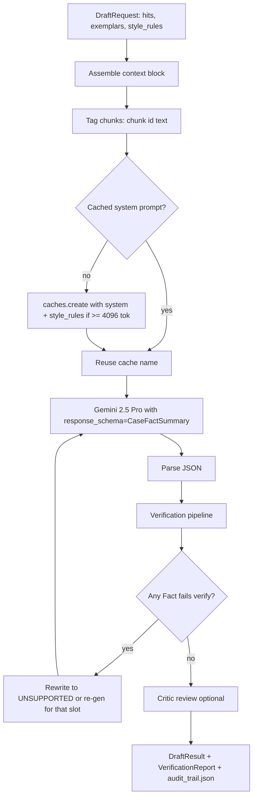
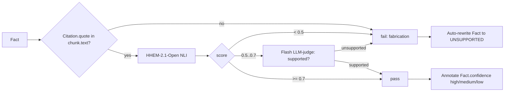
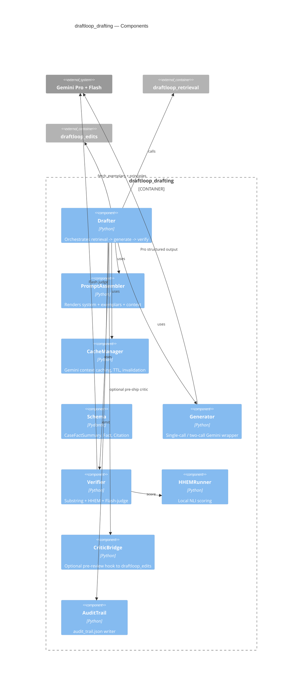

# DraftLoop — Phase 03: Draft Generation & Verification

| Field         | Value                                                  |
| ------------- | ------------------------------------------------------ |
| Package       | `packages/draftloop_drafting`                          |
| Rubric weight | §2 Retrieval & Grounding (shared) + §3 Draft Quality   |
| Depends on    | `draftloop_core`, `draftloop_retrieval`, `draftloop_edits` (for exemplars/principles) |
| Status        | Approved                                               |

## 1. Goal

Generate a **grounded, structured, verified** Case Fact Summary. Every Fact
carries ≥1 Citation whose `quote` is a verbatim substring of the cited
chunk. Missing or contradictory evidence yields `UNSUPPORTED` — structurally
required by the schema, post-validated by a tiered verifier.

## 2. Public API

```python
# packages/draftloop_drafting/src/draftloop_drafting/__init__.py
from draftloop_drafting.orchestrator import Drafter
from draftloop_drafting.schema       import CaseFactSummary, Fact, Citation
from draftloop_drafting.verify       import Verifier
from draftloop_drafting.types        import DraftRequest, DraftResult, VerificationReport
```

One operation: `Drafter.draft(req: DraftRequest) -> DraftResult`.

## 3. Output schema — structural grounding

```python
class Citation(BaseModel):
    chunk_id: str
    quote: str = Field(..., max_length=240)   # verbatim substring of chunk.text

class Fact(BaseModel):
    sentence_id: str                          # stable "s_007"
    text: str
    citations: list[Citation] = Field(..., min_length=1)
    confidence: Literal["high", "medium", "low"]

class CaseFactSummary(BaseModel):
    parties: list[Fact]
    jurisdiction: list[Fact]
    key_dates: list[Fact]
    claims: list[Fact]
    relief_sought: list[Fact]
    procedural_posture: list[Fact]
    key_evidence: list[Fact]

UNSUPPORTED = "UNSUPPORTED"   # sentinel; citations=[] only legal when text == UNSUPPORTED
```

`min_length=1` on `Citation` list makes ungrounded facts structurally
illegal. The only escape is the sentinel, which the schema validator
specifically permits.

## 4. Generation pipeline



### Single-call vs two-call

- **Default (`DRAFTER_MODE=single_call`).** One call to `gemini-2.5-pro`
  with `response_schema=CaseFactSummary`. Cheaper. Works because we use
  inline chunk-ID tags, not the grounding API.
- **Fallback (`DRAFTER_MODE=two_call`).** First call returns Markdown with
  inline `[doc_3_p4_¶12_c_0012]` tags. Second call restructures to JSON
  schema. Safer if single-call reliability degrades; double the cost.

### Context budget

- Top-15 hits × 7 slots = 105 chunks. After dedup typically 40–60 unique.
- 40–60 chunks × ~400 tokens ≈ 16k–24k tokens of context.
- Within Pro's 1M context and **under the ~30k threshold** above which
  Flash starts dropping citation quotes (research-validated pitfall).

### Context caching

- System instructions + rendered chunk corpus → single cached prefix per
  matter drafting session.
- 4,096 token floor on Pro; corpora below the floor skip caching.
- TTL `3600s` default. Cache name keyed on
  `hash(matter_id + corpus_version + system_prompt_hash)`, where
  `corpus_version = sha256(sorted({doc_id: ingest_version}))` over every
  doc in the matter. Any single re-ingest bumps `corpus_version` and
  invalidates the cache cleanly.

## 5. Prompt scaffold

### System prompt (cached)

```
You draft case-fact summaries for a litigation team. The summary must be
GROUNDED — every Fact.text MUST be supported by ≥1 Citation drawn from the
<context> block below. Citations MUST be VERBATIM substrings of the cited
chunk (Citation.quote ⊆ chunk.text after whitespace-normalize).

If evidence is missing, contradictory, or low-confidence for a slot, emit
EXACTLY: Fact(text="UNSUPPORTED", citations=[]). Do not infer, do not
paraphrase unsupported claims, do not merge facts from different chunks
unless you cite all sources.

If a chunk's contains_needs_review=true, treat it as low-confidence evidence
— corroborate with another chunk or emit UNSUPPORTED.

STYLE RULES (learned from operator edits):
{style_rules}                              # ≤50 Principles, concatenated

EXEMPLARS — past edits the team approved. Mimic structure and tone, NOT specific facts:
{fact_exemplars}                           # k=5 from edit memory, fact_correction class
{style_exemplars}                          # k=3 from edit memory, tone/structure class

<context>
{tagged_chunks}
</context>
```

Where each chunk is rendered:

```
<chunk id="doc_3_p4_¶12_c_0012" page="4" section="Claims" confidence_min="0.92" needs_review="false">
{chunk.text}
</chunk>
```

### User prompt (per draft)

```
Draft a Case Fact Summary for matter {matter_id}. Use ONLY the <context>
above. Return JSON matching the CaseFactSummary schema.
```

## 6. Verification — tiered, cheapest-first



- **Tier 1 — Substring check.** Whitespace-normalize both sides;
  `quote in chunk.text`. Catches ~60–70% of fabrications. Mandatory.
- **Tier 2 — HHEM-2.1-Open.** Local NLI (~600MB) returns 0–1.
  `< 0.5` → fail; `0.5–0.7` → escalate; `>= 0.7` → pass.
- **Tier 3 — Flash LLM-judge.** Only for HHEM-uncertain band. Returns
  `SUPPORTED` / `UNSUPPORTED`.

Failed facts are **rewritten to `UNSUPPORTED`** (not deleted) and the
original draft + reason are logged in `VerificationReport`. The system
demonstrates it tried and abstained — correct behavior under the rubric.

## 7. `VerificationReport`

```python
class FactVerification(BaseModel):
    sentence_id: str
    substring_passed: bool
    hhem_score: float | None
    llm_judge: Literal["supported", "unsupported", "skipped"]
    final_verdict: Literal["pass", "rewrite_to_unsupported"]
    original_text: str | None         # if rewritten, what was there
    fail_reason: str | None

class VerificationReport(BaseModel):
    matter_id: str
    draft_id: str
    fact_results: list[FactVerification]
    summary: dict[str, int]           # {"pass": 22, "rewrite": 3, ...}
    duration_ms: int
```

## 8. Audit trail

Persisted alongside the draft as `audit_trail.json`. Every drafting run
must produce one. Schema:

```json
{
  "matter_id": "M-001",
  "draft_id": "D-2026-05-15-001",
  "model": "gemini-2.5-pro",
  "drafter_mode": "single_call",
  "prompt_hash": "sha256:…",
  "cache_name": "cachedContents/abc123",
  "retrieved_chunks": [{
    "chunk_id": "doc_3_p4_¶12_c_0012",
    "slot": "claims",
    "rerank_score": 8.4,
    "engines": ["dense", "bm25"]
  }],
  "exemplars_used": [
    {"edit_id": "E-…", "class": ["fact_correction"], "induced_rule": "…", "trust_weight": 0.9}
  ],
  "style_rules_active": ["P-007", "P-012"],
  "verification": {/* VerificationReport */},
  "token_usage": {"input": 21088, "cached": 18342, "output": 2104},
  "cost_usd": 0.073,
  "duration_ms": 4920,
  "ingest_versions": {"doc_3": "v1.2", "doc_4": "v1.2"}
}
```

This is the inspection surface the rubric calls "make it possible to inspect
which evidence supported which part of the output."

## 9. Component-level C4



## 10. Tests

| Layer | Coverage |
|---|---|
| Schema | Pydantic round-trip; fabricated `Citation.quote` fails substring check |
| Mocked LLM | Deterministic prompt assembly given fixed inputs (golden prompt snapshots) |
| Unit | Verifier tier escalation logic on synthetic `(claim, chunk)` triples labeled entail/contradict/neutral |
| Integration | Against synthetic corpus: ≥95% of generated Facts pass substring; ≥85% pass HHEM; UNSUPPORTED ≤15% |
| Adversarial | Corpus missing key_dates evidence → drafter emits UNSUPPORTED (does not fabricate) |
| Cost | One full Case Fact Summary <$0.10 on Pro, <$0.02 on Flash |
| Cache | Same draft requested twice within TTL → cached tokens > 70% of input on second call |

## 11. Failure modes & mitigation

| Failure | Mitigation |
|---|---|
| Model returns invalid JSON | Pydantic error → one-shot re-prompt with the error; persistent failure → fall back to `DRAFTER_MODE=two_call` |
| Model fabricates a Citation.quote | Substring check fails → Fact rewritten to UNSUPPORTED, original logged |
| Model emits sentinel as a verb form ("evidence is unsupported") | Strict equality check on `Fact.text == "UNSUPPORTED"`; anything else goes through normal verification |
| Cache invalidation lag (corpus re-ingested) | Cache name keyed on `corpus_version`; re-ingest bumps version |
| HHEM model not downloaded | First-boot warm-up downloads to `data/models/`; `/health` exposes `hhem.ready` |
| Critic over-rewrites and breaks citations | Critic is advisory by default; never mutates `Fact`s without operator approval |
| Token budget exceeded for very large matters | Slot retrieval already caps; further fallback: drop lowest-rerank chunks until under budget; log drops |
| Gemini safety filter blocks legal terminology | `safety_settings` set to `BLOCK_NONE` on 4 categories (per Gemini docs) |
| Model duplicates Facts across slots | Post-pass deduplication by sentence-embedding similarity; merge citations |

## 12. Open decisions deferred to implementation

- Production default `DRAFTER_MODEL` is `gemini-2.5-pro` (see Phase 07
  `.env.example`). The open decision is whether `DraftingSuite` (Phase 06)
  runs Pro-only by default or runs the full `mode × model` A/B grid; the
  cost-budget cap will likely force Pro-only as the CI default.
- HHEM threshold tuning — start with 0.5/0.7, tune on `data/golden/`.
- Whether to expose `confidence` as `high/medium/low` (current) or a 0–1
  score on the wire (proposed: keep enum; backend retains the float).

## 13. Cross-references

- Overview: `2026-05-15-00-overview-design.md`
- Upstream: `2026-05-15-02-retrieval-design.md`
- Sibling consumer of `draftloop_edits`: `2026-05-15-05-improvement-loop-design.md`
- UI surface: `2026-05-15-04-operator-ui-design.md`
