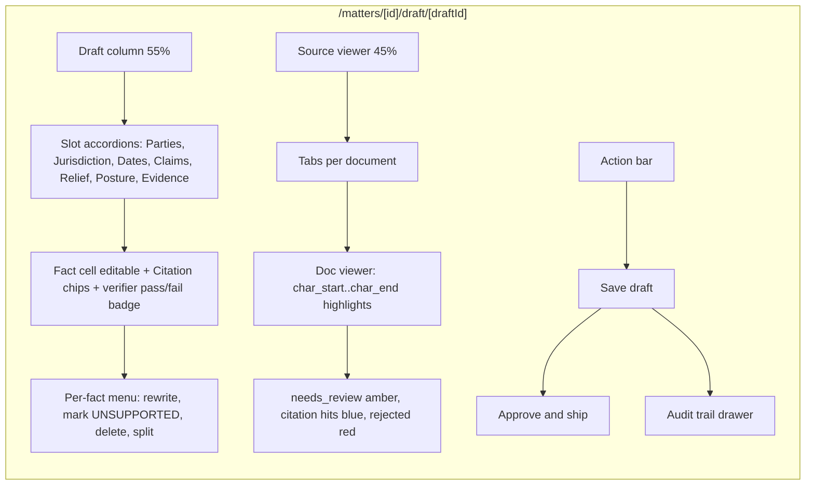
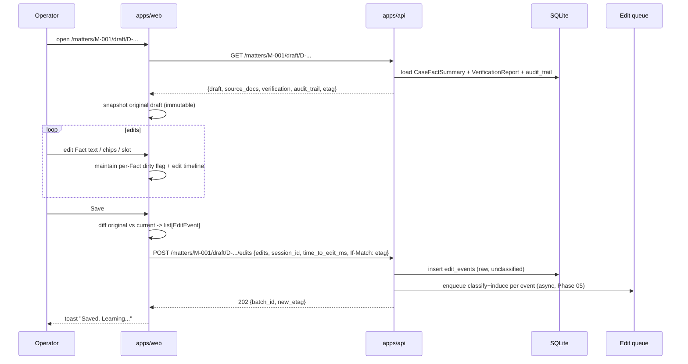
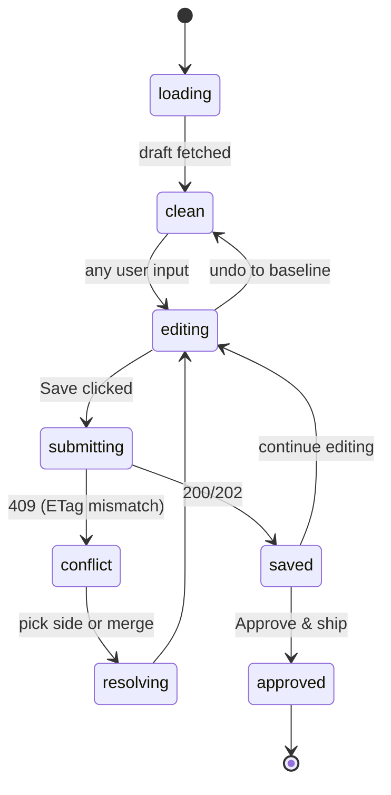
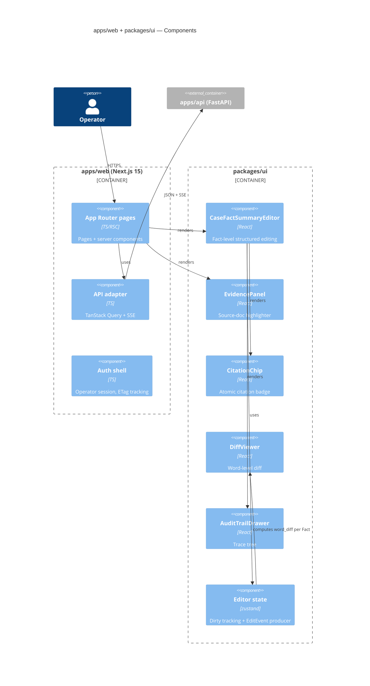

# DraftLoop — Phase 04: Operator UI & Edit Capture

| Field         | Value                                                          |
| ------------- | -------------------------------------------------------------- |
| Workspace     | `apps/web` (Next.js 15) + `packages/ui` (shared React components) |
| Rubric weight | §4 Improvement from Edits (capture portion) + §3 Draft Quality (review UX) |
| Depends on    | `apps/api`, contracts from `draftloop_drafting` and `draftloop_edits` |
| Status        | Approved                                                       |

## 1. Goal

Give the operator a side-by-side surface to review a generated draft, inspect
its citations against the source, and capture structured edits at the **Fact
level** so the learning loop receives the richest possible signal.

This phase covers **capture and presentation only**. Classification,
induced-rule extraction, memory storage, and critic review live in Phase 05.

## 2. Editor layout



## 3. Fact-level structured editing

Each `Fact` is an editable cell. Operator can:

- Edit `Fact.text` inline (controlled `<textarea>` with autosize)
- Click a Citation chip → source viewer scrolls + highlights `quote`
- Add a Citation by **selecting text in the source viewer** and clicking
  *Cite this for current fact*. Substring guarantee follows from selection.
- Remove a Citation via its `×` button
- Mark a Fact `UNSUPPORTED` (collapses to sentinel, clears citations)
- Delete the Fact, or split it into two at the cursor
- Add a new Fact under any slot (`edit_class: addition`)
- Reorder Facts within a slot (drag)
- Convert to free-form via *Restructure* escape hatch → captured as
  `edit_class: structural` with a textual diff

Free-form is intentionally *not* the primary mode. Fact-level capture gives
the learning loop a far stronger signal.

## 4. Open → edit → save sequence



The frontend does the diffing so the backend never reconstructs intent from a
raw text blob — it gets a clean `EditEvent[]`.

## 5. `EditEvent` capture contract

```typescript
// packages/ui/src/types/edits.ts  (mirrors draftloop_core's Python EditEvent)
export type EditOp =
  | "fact_text_changed"
  | "citation_added"
  | "citation_removed"
  | "fact_marked_unsupported"
  | "fact_deleted"
  | "fact_split"
  | "fact_added"
  | "fact_reordered"
  | "slot_structural";

export interface EditEvent {
  event_id: string;                              // ulid
  draft_id: string;
  matter_id: string;
  slot: string;
  sentence_id: string | null;                    // null for fact_added / slot_structural
  op: EditOp;
  before: { text?: string; citations?: Citation[] } | null;
  after:  { text?: string; citations?: Citation[] } | null;
  source_evidence_ids: string[];                 // chunk_ids in before ∪ after
  word_diff: string | null;                      // unified diff, only if op="fact_text_changed"
  time_to_edit_ms: number;
  operator_id: string;
  draft_model_version: string;
  prompt_hash: string;
  timestamp: string;
}
```

The UI **never** invents an `edit_class` — that's a model decision and lives
in Phase 05.

## 6. Editor state machine



Optimistic concurrency via `If-Match` ETag. On 409 the UI loads the other
operator's `EditEvent` list and renders a **3-way merge** (yours / theirs /
base).

## 7. Source-doc viewer

- Renders the **ingested Markdown** (canonical citation surface), with a
  side toggle to view the original PDF via `<embed>`.
- Spans highlighted by **decorated ranges** built from chunk
  `(char_start, char_end)` — not regex.
- Color legend:
  - **Blue** — citation for the focused Fact
  - **Teal** — citations from other Facts
  - **Amber** — `NeedsReviewSpan` from ingest
  - **Red** — chunk rejected by the verifier
- Clicking any highlighted range opens a popover with: the Fact(s) citing
  it, rerank score, and an audit-trail chip.

## 8. `packages/ui` — shared components

| Component | Purpose |
|---|---|
| `<CaseFactSummaryViewer>`   | Read-only render with citation chips |
| `<CaseFactSummaryEditor>`   | Full Phase-04 editor; `(summary, sourceDocs, onSave)` |
| `<EvidencePanel>`           | Source-doc viewer with span highlighting |
| `<CitationChip>`            | Atomic citation badge; click → `onResolve` |
| `<DiffViewer>`              | Word-level diff (audit drawer + 3-way merge) |
| `<AuditTrailDrawer>`        | Renders `audit_trail.json` as a tree |
| `<NeedsReviewBanner>`       | Visual alert for low-confidence ingestion |
| `<JobProgressSSE>`          | Subscribes to `/jobs/{id}` |

**Rules** (enforced by `CLAUDE.md`):

1. Components are purely presentational: `(data, callbacks) → JSX`.
2. No fetch / API client / URL inside `packages/ui`. Data adapters live in
   `apps/web/src/lib/api`.
3. Editor state via `zustand` — any host app can supply its own store factory.

**Stack inside `packages/ui`:** React 19, Tailwind, `shadcn/ui` primitives
(Radix-based, accessible), `cmdk` (command palette), `react-aria` (selection
model), `diff-match-patch` (word-diff), `zustand` (state).

## 9. `apps/web` routes

```
/                                            # matter list
/matters/[id]                                # matter dashboard: docs + drafts
/matters/[id]/ingest                         # upload + watch ingestion progress
/matters/[id]/draft/new                      # trigger draft generation
/matters/[id]/draft/[draftId]                # the editor (this phase)
/matters/[id]/draft/[draftId]/audit          # full audit-trail page
/admin/edits                                 # learning-loop telemetry (Phase 05)
/admin/rules                                 # Principles catalog review queue (Phase 05)
/admin/replay                                # Held-out replay charts (Phase 05/06)
```

API contract `apps/api` exposes (concrete shapes in `apps/api/openapi.json`):

- `GET  /api/matters/:id/drafts/:draftId` → `{draft, sourceDocs, verification, auditTrail}` + ETag
- `POST /api/matters/:id/drafts/:draftId/edits` → 202 `{batchId, new_etag}`; `If-Match` required
- `POST /api/matters/:id/drafts/:draftId/approve` → `{shipped: true}`; latches all edits
- `GET  /api/matters/:id/drafts/:draftId/events` (SSE) — live verification + critic events

## 10. Component-level C4



## 11. Privacy & instrumentation

- Operator session: simple JWT in dev (mock provider), pluggable to NextAuth.
- Edit telemetry includes `operator_id` and `time_to_edit_ms` per Fact —
  **not per-keystroke timing**. Explicitly avoids being a keystroke logger.
- All draft/edit data persists locally (SQLite); zero third-party telemetry
  by default. `LANGFUSE_HOST` env opts in to a trace exporter.

## 12. Tests

| Layer | Coverage |
|---|---|
| Component | Snapshot + interaction tests for each `packages/ui` component (Vitest + Testing Library) |
| Editor unit | zustand store produces correct `EditEvent[]` for scripted edit sequences |
| Contract | OpenAPI ↔ TS types drift check in CI |
| E2E (Playwright) | Open draft → edit two facts → add one citation → save → assert `POST /edits` payload matches expected `EditEvent[]` |
| A11y | axe-core run on every editor route; zero violations |
| Visual regression (optional) | Storybook + Chromatic for `packages/ui` |

## 13. Failure modes & mitigation

| Failure | Mitigation |
|---|---|
| Operator edits offline; comes back to a regenerated draft | ETag mismatch → 409 + 3-way merge UI; never silently overwrite |
| Operator drags a Fact between slots | Captured as `slot_structural` so the learner can track slot misclassification |
| Operator pastes a 10k-char "fact" | Soft 1,000-char limit per Fact with warning; over-limit auto-splits at sentence boundary |
| Source-doc viewer offsets drift after re-ingest | Citation chips carry `chunk_id`, not raw offsets; viewer resolves live |
| Large `word_diff` payload | If `word_diff > 8KB`, drop and keep `before`/`after` only |
| Operator types a citation `quote` freehand | Citation creation requires text selection in the viewer — substring is structurally guaranteed |
| Two operators on same draft concurrently | Presence channel `/draft/{id}/presence` via SSE; second gets soft warning + ETag merge on save |
| Citation chip points to a chunk that no longer exists (re-ingest dropped it) | UI shows the chip as `stale` with a "remap or remove" affordance; not a hard error |

## 14. Open decisions deferred to implementation

- Whether to ship an in-product onboarding tour (proposed: skip, add a 60-sec
  Loom in the README instead).
- Dark mode (proposed: ship with `shadcn` default theme switcher).
- Storybook public preview deployment (proposed: skip for v1).

## 15. Cross-references

- Overview: `2026-05-15-00-overview-design.md`
- Backend producer of drafts: `2026-05-15-03-drafting-design.md`
- Backend consumer of edits: `2026-05-15-05-improvement-loop-design.md`
- Platform / monorepo: `2026-05-15-07-platform-design.md`
