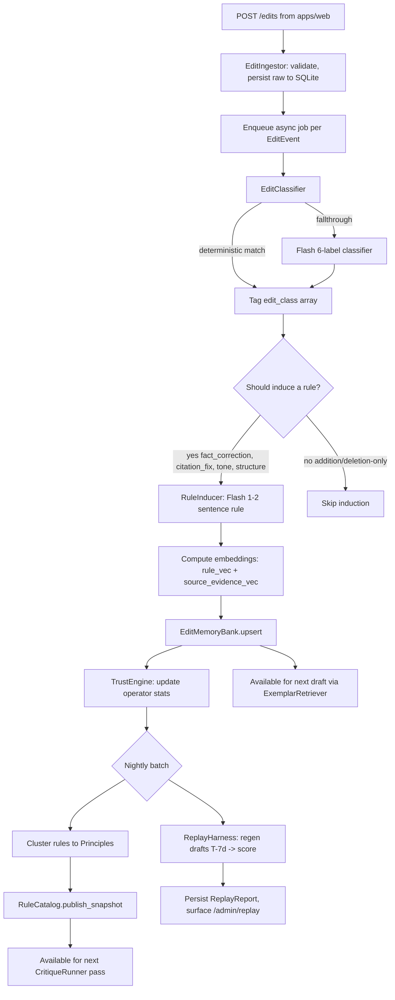
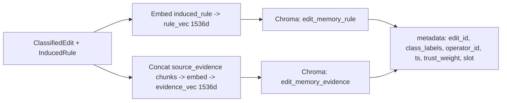
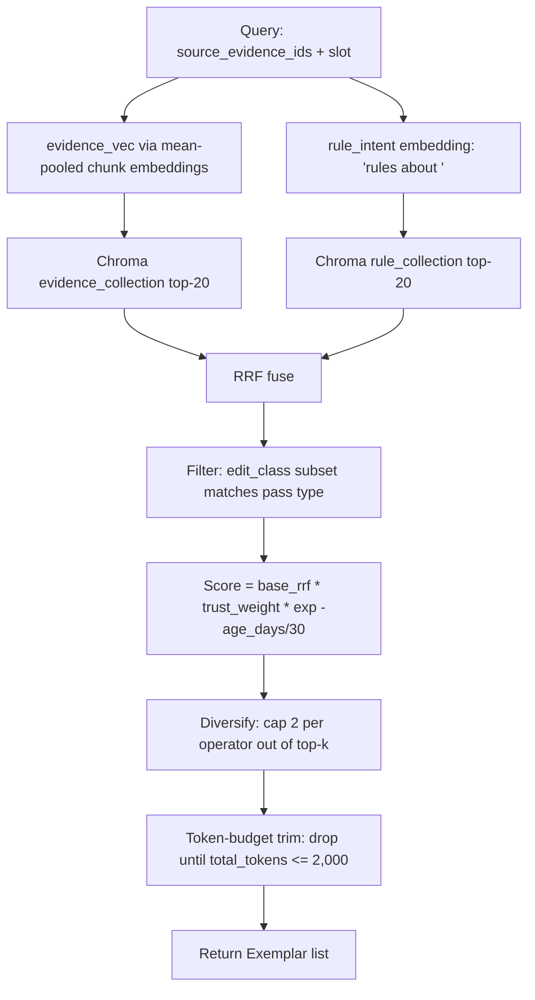
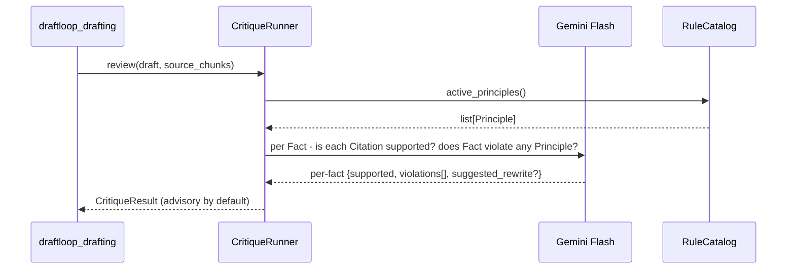
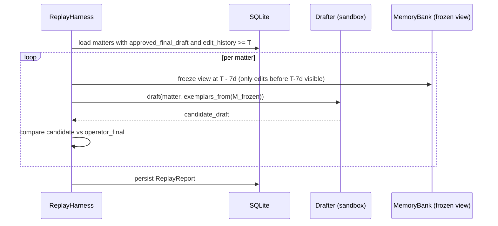
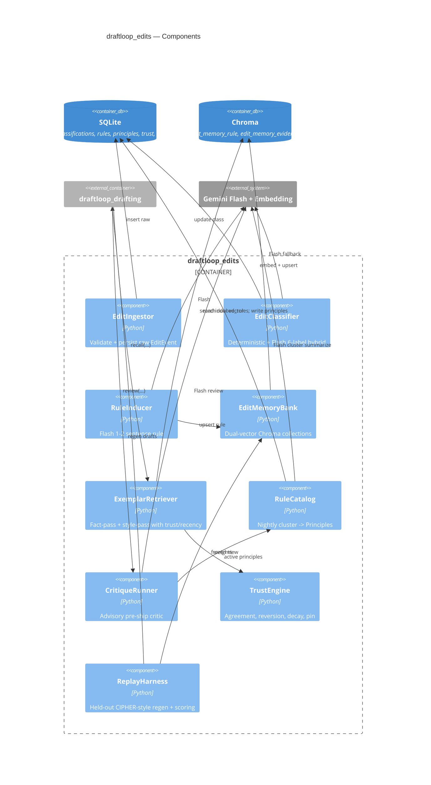
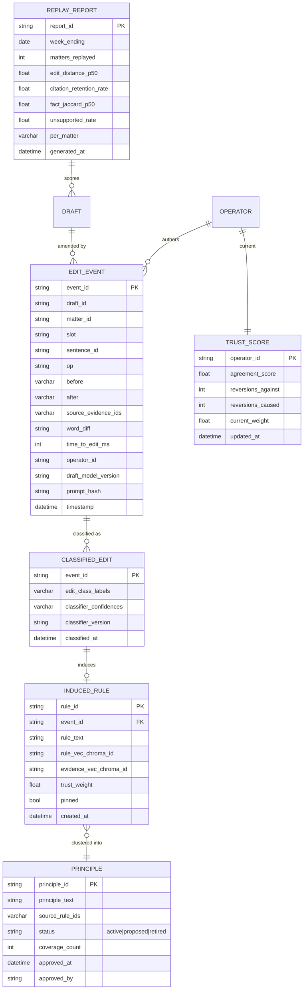

# DraftLoop — Phase 05: Improvement Loop (Edit Capture → Memory → Critic → Replay)

| Field         | Value                                            |
| ------------- | ------------------------------------------------ |
| Package       | `packages/draftloop_edits`                       |
| Rubric weight | §4 Improvement from Edits — **25 points**         |
| Depends on    | `draftloop_core`, consumes `EditEvent`s from `apps/api` (Phase 04) |
| Provides     | Exemplars + Principles + Critic to `draftloop_drafting` (Phase 03) |
| Status        | Approved                                         |

## 1. Goal

Turn raw `EditEvent`s into reusable signal that **measurably** improves
future drafts. "Real improvement loop, not a side-by-side version diff" is
the rubric's explicit demand.

Architecture builds directly on **PRELUDE/CIPHER** (NeurIPS 2024) — the
closest published prior art — with production patterns layered on top:
trust weighting, recency decay, fact/style retrieval separation, and held-out
replay as the primary improvement metric.

## 2. Public API

```python
# packages/draftloop_edits/src/draftloop_edits/__init__.py
from draftloop_edits.ingestor      import EditIngestor
from draftloop_edits.classifier    import EditClassifier
from draftloop_edits.rule_inducer  import RuleInducer
from draftloop_edits.memory        import EditMemoryBank
from draftloop_edits.exemplars     import ExemplarRetriever
from draftloop_edits.catalog       import RuleCatalog
from draftloop_edits.critic        import CritiqueRunner
from draftloop_edits.trust         import TrustEngine
from draftloop_edits.replay        import ReplayHarness
from draftloop_edits.types         import (
    EditEvent, ClassifiedEdit, InducedRule, Exemplar, ExemplarBundle,
    Principle, CritiqueResult, TrustScore, ReplayReport, EditClass
)
```

**Surfaces drafting consumes** (Phase 03 wires these):

- `ExemplarRetriever.recall(source_evidence_ids, slot) -> ExemplarBundle`
- `RuleCatalog.active_principles() -> list[Principle]`
- `CritiqueRunner.review(draft, principles) -> CritiqueResult`

**Surfaces ops/eval consumes** (Phases 06 + admin pages):

- `ReplayHarness.run(date_T) -> ReplayReport` — the primary improvement metric
- `RuleCatalog.snapshot()` — operator-readable principles list

## 3. End-to-end edit lifecycle



## 4. `EditClassifier` — hybrid, cheapest-first

```python
class EditClass(StrEnum):
    fact_correction = "fact_correction"
    citation_fix    = "citation_fix"
    tone            = "tone"
    structure       = "structure"
    addition        = "addition"
    deletion        = "deletion"
```

**Stage A — deterministic.** Pure-Python rules, covers ~80% of edits:

| Heuristic | Label |
|---|---|
| Date / number / proper-noun regex changed in text | `fact_correction` |
| Only `Citation` list differs (no text change) | `citation_fix` |
| Whitespace / punctuation / case-only change | `tone` |
| Sentence reorder without token-set change | `structure` |
| `op == "fact_added"` | `addition` |
| `op in {"fact_deleted", "fact_marked_unsupported"}` | `deletion` |

**Stage B — Flash fallback.** Anything Stage A didn't tag (or tagged
ambiguously) → `gemini-2.5-flash` with a 6-label classification prompt and
per-label confidence. Multi-label allowed.

## 5. `RuleInducer` — induced-rule per edit

For each classified edit (except pure `addition`/`deletion`), Flash produces
a **1–2 sentence portable rule**:

```
INPUT:
  before: "Plaintiff alleges breach of contract on March 14th, 2024."
  after:  "Plaintiff alleges breach of the SaaS agreement on 2024-03-14."
  source_evidence: [chunk doc_3_p4_¶12: "...the SaaS agreement, executed 2024-03-14..."]
  edit_class: [fact_correction, tone]
OUTPUT (induced_rule):
  "Use ISO-8601 dates and specify the contract type (e.g., 'SaaS agreement')
   rather than generic 'contract' when source identifies it."
```

The induced rule is the **embedding payload** that makes retrieval-of-edits
useful at draft time. Embedded with `gemini-embedding-001`
(`task_type=RETRIEVAL_DOCUMENT`).

## 6. `EditMemoryBank` — dual-vector



Two separate collections so we can query by **rule similarity** and **evidence
similarity** independently. Hits fused via RRF.

## 7. `ExemplarRetriever` — fact-pass and style-pass

Two **independent** retrievals so style exemplars never contaminate fact
extraction (research-validated anti-pattern).

```python
class Exemplar(BaseModel):
    edit_id: str
    induced_rule: str
    before_text: str | None
    after_text: str | None
    edit_class: list[EditClass]
    operator_id: str
    trust_weight: float
    age_days: int

class ExemplarBundle(BaseModel):
    fact_exemplars: list[Exemplar]    # max 5
    style_exemplars: list[Exemplar]   # max 3
    total_tokens: int                 # hard cap 2,000
```

Per pass:



**Fact pass** filters to `{fact_correction, citation_fix}`, k=5.
**Style pass** filters to `{tone, structure}`, k=3.

## 8. `RuleCatalog` — Constitutional Principles

Nightly batch job:

1. Pull `induced_rule`s with `trust_weight ≥ 0.5`, last 90 days.
2. Embed; cluster via HDBSCAN (no fixed k — emergent groupings).
3. Per cluster of ≥3 rules → Flash summarizes into a **Principle** (≤30 words,
   imperative voice).
4. Hand-review queue at `/admin/rules`: approve / reject / edit.
5. Approved Principles are the `style_rules` block for drafting and the
   `principles` input to `CritiqueRunner`.

Hard cap: **≤50 active Principles**. Excess demoted by coverage.

## 9. `CritiqueRunner` — pre-ship critic



- Advisory by default — never mutates `Fact`s.
- `CRITIC_AUTO_APPLY=true` enables auto-apply of deterministic rewrites only
  (date format normalization, term substitution) and never touches citations.
- Uses Flash (cheap); ~1–2s end-to-end latency.

## 10. `TrustEngine` — defend against catastrophic feedback

| Mechanism | What it does |
|---|---|
| Pairwise agreement | Two operators editing the same slot across matters → Jaccard score → below-median operators get `trust_weight=0.5` |
| Reversion demotion | Operator B undoes A's edit within 7 days → A's `trust_weight *= 0.3`; after 14 days A's edit excluded from new retrievals |
| Per-operator cap | `ExemplarRetriever` caps any single operator to ≤2 of top-5 / ≤1 of top-3 |
| Recency decay | `score *= exp(-age_days / 30)`; hard cutoff at 180 days unless re-affirmed |
| Approval pin | Operator can pin an edit ("house style") → `trust_weight=1.0`, decay-exempt |
| Seed rules | Bootstrap with 5–10 curated rules under `operator_id="__seed__"` so cold-start works |

## 11. `ReplayHarness` — primary improvement metric



**Reported metrics:**

- `edit_distance_per_draft` (lower-is-better) — primary trendline
- `citation_retention_rate`
- `fact_jaccard_high_confidence`
- `unsupported_rate_delta` (correct abstention behavior)
- `time_to_approve_s_p50` (pulled from production sessions, separate input)

Surfaced at `/admin/replay`. This chart is what the README leads with.

## 12. Component-level C4



## 13. ER schema (additions for this phase)



## 14. Tests

| Layer | Coverage |
|---|---|
| Classifier unit | Golden `(before, after)` pairs per `EditClass` → assert Stage A correctness; Stage B confident picks |
| RuleInducer integration | Curated 10-pair set → induced rules snapshot test for stability |
| MemoryBank | Upsert idempotency on `edit_id`; deletion cascades; per-matter isolation |
| ExemplarRetriever | Synthetic edit corpus → (a) token budget honored, (b) per-operator cap honored, (c) fact-pass returns zero `tone`/`structure` exemplars and vice versa |
| TrustEngine | Scripted reversion sequence → assert demotion math; pinned edits exempt |
| CritiqueRunner | Drafts with planted Principle violations → critic flags them |
| ReplayHarness e2e | 5 matters × 3 weeks of edits → assert `edit_distance` improves on "good" stream, flat on noisy control |
| Anti-poisoning | 1 operator with bad edits → trust < 0.5 within N reversions; exemplars filtered out |

## 15. Failure modes & mitigation

| Failure | Mitigation |
|---|---|
| Paste-bomb (10k tiny edits / sec) | Per-operator rate limit at ingest; consecutive edits on same Fact within 10s auto-batched |
| Flash classifier hallucinates a label | Schema enforces enum; OOV → Stage A only, flagged for review |
| Induced rule contradicts existing Principle | Catalog clustering surfaces as `conflict` item at `/admin/rules` |
| Memory bank grows unbounded | TTL 180 days unless pinned; nightly compaction |
| Replay hits Gemini rate limits | Batch API; overnight runs with no SLA |
| Cold start: no edits yet | `ExemplarRetriever` returns empty bundle; drafting skips exemplar block — no errors |
| All operators bad → no anchor | Bootstrap 5–10 pinned `__seed__` rules; replaceable as real signal accumulates |
| Critic suggests rewrite that violates another Principle | Single-pass advisory; no auto-rewrite loop |
| Reverted-edit detection false-positive (legit re-edit of same wording) | Reversion demotion is soft (`*=0.3`, not zero); a single FP is recoverable |

## 16. Open decisions deferred to implementation

- Async job runner: FastAPI `BackgroundTasks` (Phase 07 default) vs lightweight in-process queue. Both honor the public API.
- Nightly job scheduler: `apscheduler` in the API process vs cron container. Proposed: `apscheduler` (one process to run).
- Principle hand-review UI: minimal table at `/admin/rules` for v1; richer batch operations later.

## 17. Cross-references

- Overview: `2026-05-15-00-overview-design.md`
- Consumer (drafting): `2026-05-15-03-drafting-design.md`
- Producer (UI/edit capture): `2026-05-15-04-operator-ui-design.md`
- Eval that calls `ReplayHarness`: `2026-05-15-06-evaluation-design.md`
