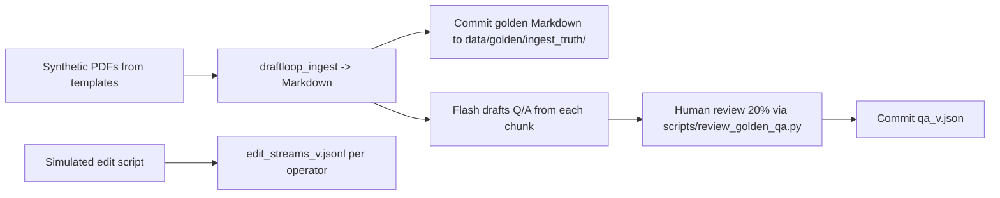
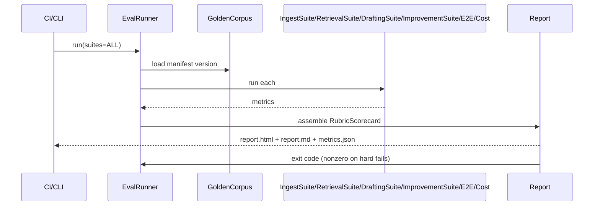
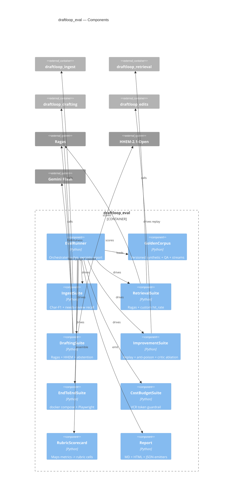

# DraftLoop — Phase 06: Evaluation Harness

| Field         | Value                                              |
| ------------- | -------------------------------------------------- |
| Package       | `packages/draftloop_eval`                          |
| Rubric weight | All 6 rubric sections (this phase produces the scorecard) |
| Depends on    | All other `draftloop_*` packages                   |
| Status        | Approved                                           |

## 1. Goal

Produce the report a reviewer reads. Map every rubric section to a concrete,
automated metric so "did we get better this week?" has a real answer.

## 2. Public API

```python
# packages/draftloop_eval/src/draftloop_eval/__init__.py
from draftloop_eval.runner  import EvalRunner
from draftloop_eval.suites  import (
    IngestSuite, RetrievalSuite, DraftingSuite,
    ImprovementSuite, EndToEndSuite, CostBudgetSuite
)
from draftloop_eval.golden  import GoldenCorpus, GoldenQA, GoldenEditStream
from draftloop_eval.metrics import RubricScorecard
from draftloop_eval.report  import Report, write_html, write_md, write_json
```

Single entrypoint: `EvalRunner().run(suites=[...]) -> Report`.

Invocation: `python -m draftloop_eval` (CLI) or `scripts/eval.sh` (CI).

## 3. Rubric → metric mapping

| Rubric section | Points | Primary metric | Secondary | Pass threshold |
|---|---|---|---|---|
| Document Processing | 25 | `extraction_f1` (char-level vs golden Markdown via `SequenceMatcher.ratio`) | `needs_review_recall` on injected illegible | ≥0.90 / ≥0.80 |
| Retrieval & Grounding | 25 | Ragas `context_precision@10` | Ragas `context_recall@10`, golden-chunk `hit_rate@5` | ≥0.75 / ≥0.80 / ≥0.85 |
| Draft Quality | 10 | Ragas `faithfulness` | `answer_relevance`, HHEM mean | ≥0.85 / ≥0.80 / ≥0.75 |
| Improvement from Edits | 25 | `edit_distance_p50_trend` over 3 weeks (↓ ≥15%) | `citation_retention_rate`, anti-poison precision | trend met / ≥0.85 / ≥0.95 |
| Code Quality & Design | 10 | ruff + mypy strict + radon CC<10, coverage | — | clean / coverage met |
| Documentation & Clarity | 5 | doc lint, diagrams render, README runnable | reviewer time-to-first-draft < 10 min | passes / ≤10 min |

A failing threshold colors the cell red — visibility, not a CI block (except
`CostBudgetSuite` regressions, which do block).

## 4. `GoldenCorpus`

Versioned, deterministic fixture under `data/golden/`. Source PDFs generated
deterministically from templates (seed 42); golden truth is committed
markdown, never regenerated.

```python
class GoldenCorpus(BaseModel):
    version: str                      # semver
    documents: list[GoldenDoc]        # 12 synthetic docs, all quality classes
    qa_set: list[GoldenQA]            # ~60 Q/A pairs (~10 per slot)
    edit_streams: list[GoldenEditStream]  # 3 simulated operators × 3 weeks
    ingest_truth: dict[str, GoldenIngestTruth]

class GoldenQA(BaseModel):
    qa_id: str
    slot: str
    question: str
    expected_fact_text: str
    must_cite_chunk_ids: list[str]    # ≥1 chunk containing the answer
    is_unsupported: bool              # negative test

class GoldenEditStream(BaseModel):
    operator_id: str                  # "good_op_1" / "good_op_2" / "noisy_op"
    intent: Literal["aligned", "noisy"]  # noisy_op seeds anti-poisoning suite
    weeks: list[GoldenEditWeek]       # one entry per simulated week (3 total)

class GoldenEditWeek(BaseModel):
    week_index: int                   # 0..2
    events: list[EditEvent]           # synthetic, conforms to Phase 04 EditEvent shape
```

`scripts/build_edit_streams.py` synthesizes the streams deterministically
(seed `42`): two aligned operators apply consistent date/style rules; the
noisy operator emits random word swaps and fake citations so the
anti-poisoning test in `ImprovementSuite` has a known ground truth.

Generation pipeline:



**Negative tests matter.** ~15% of QA pairs are `is_unsupported=True` —
facts deliberately not present in the corpus. Drafter must emit
`UNSUPPORTED`, not fabricate.

## 5. Suite designs

### `IngestSuite`

- Char-level F1 of extracted Markdown vs `ingest_truth.markdown`
- Per-class breakdown: digital / clean scan / low-res / handwritten / photo / illegible
- `needs_review_spans` precision/recall/F1 vs injected damage regions
- Engine attribution: which engine produced what, latency/page
- Cost: $0 expected (Tier-1 only); flag any Gemini Vision firing

### `RetrievalSuite`

- For each `GoldenQA.question`: run `HybridRetriever.search`, compute
  `context_precision@10`, `context_recall@10`, `hit_rate@5` vs
  `must_cite_chunk_ids`
- Slice by retrieval mode (`dense_only`, `bm25_only`, `hybrid_no_rerank`,
  `hybrid_with_rerank`) — quantifies the rerank contribution
- Slice by slot — flags weak slots
- Latency p50/p95

### `DraftingSuite`

- Generate `CaseFactSummary` per matter in the corpus
- Per Fact: substring-pass rate, HHEM distribution, Ragas `faithfulness`,
  `answer_relevance` against `expected_fact_text`
- **Abstention precision/recall** on the `is_unsupported=True` subset
- Cost per draft (Pro <$0.10 / Flash <$0.02)
- A/B grid: `DRAFTER_MODE × DRAFTER_MODEL`

### `ImprovementSuite`

- Drives `ReplayHarness` over 3-week simulated streams
- Week 0 baseline (empty memory) → Week 3 (full memory)
- Plot `edit_distance_p50` trend over weeks (lead chart for README)
- **Anti-poisoning** test: 1 of 3 simulated operators emits deliberately bad
  edits; expect `trust_weight < 0.5` by Week 3, exemplars filtered out
- **Critic ablation**: Week 3 with `CRITIC_ENABLED=false` to quantify lift

### `EndToEndSuite`

- `docker compose up` → `scripts/seed_demo.py` → API + UI smoke
- Playwright headless: open editor, scripted edit, save, SSE round-trip
- Reviewer-experience metric: wall-clock from compose-up to first draft
  visible. Target ≤ 10 min on 16GB laptop.

### `CostBudgetSuite`

- Mini-corpus (3 docs, 1 matter) with VCR cassettes
- Asserts: no real Gemini call escapes test harness; total recorded tokens
  under per-stage budget
- **CI-blocking** if a regression silently 10×'s API spend

## 6. Eval run flow



## 7. Report artifacts

Three formats, same data:

1. **`metrics.json`** — machine-readable; CI gates + cross-run diffs
2. **`report.md`** — committed to `docs/eval-reports/YYYY-MM-DD.md`; README links latest
3. **`report.html`** — self-contained, Plotly charts (improvement curve, retrieval slice grid, HHEM histogram)

Each report opens with the **Rubric Scorecard** — color-coded cells per
rubric section, primary metric value, threshold, one-line interpretation.
That table is what the reviewer sees first.

## 8. Component-level C4



## 9. Reproducibility & determinism

- `GoldenCorpus.version` bumped on any change; recorded in every report
- All LLM calls in eval default to `temperature=0`
- Seeds pinned: `numpy`, `python random`, `torch` (HHEM) → logged in report
- VCR cassettes back `CostBudgetSuite` (CI never burns credit)
- Reports are diffable: `scripts/eval_diff.py prev.json curr.json` → per-metric deltas (used in PR descriptions)

## 10. Tests for the harness

- Unit: `RubricScorecard` mapping (given known metrics → correct cell colors)
- Property: deterministic mode → identical `metrics.json` across two runs (modulo timestamps)
- Snapshot: `report.md` vs frozen baseline; diffs gated
- Cassette freshness: CI fails if any cassette > 90 days old

## 11. Failure modes & mitigation

| Failure | Mitigation |
|---|---|
| Ragas internal model offline | Ragas configured to use Flash; falls back to local HHEM if `GEMINI_API_KEY` absent (reduced metric set, clearly labeled) |
| Golden corpus drifts | Golden truth committed; only source PDFs regenerated; OCR compared against committed truth |
| Slow suites block CI | `--suite=` flag; PR runs ingest+retrieval+drafting (fast lane); nightly runs full set including improvement (slow lane) |
| Eval costs balloon | Hard `EVAL_COST_BUDGET_USD` (default $2); `EvalRunner` exits early when exceeded |
| Reviewer can't reproduce | `scripts/eval.sh --offline` runs everything that doesn't need Gemini against cached cassettes — surfaces ~70% of metrics with zero setup |

## 12. Open decisions deferred to implementation

- Ragas version pin: track latest stable at implementation time
- Whether to publish reports to GitHub Pages (proposed: no, link from README)
- Plotly vs Vega-Lite for HTML report (proposed: Plotly, larger but offline-self-contained)

## 13. Cross-references

- Overview: `2026-05-15-00-overview-design.md`
- Drives all packages; consults `2026-05-15-05-improvement-loop-design.md` for replay
- Platform / CI wiring: `2026-05-15-07-platform-design.md`
