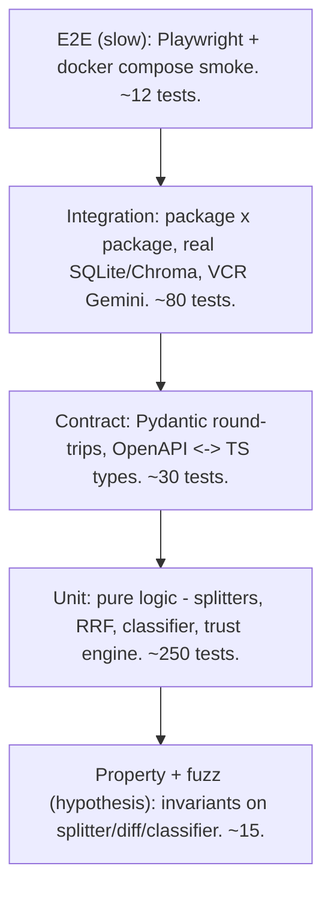
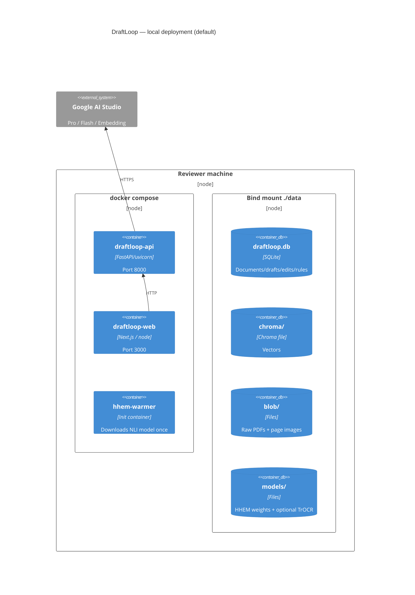
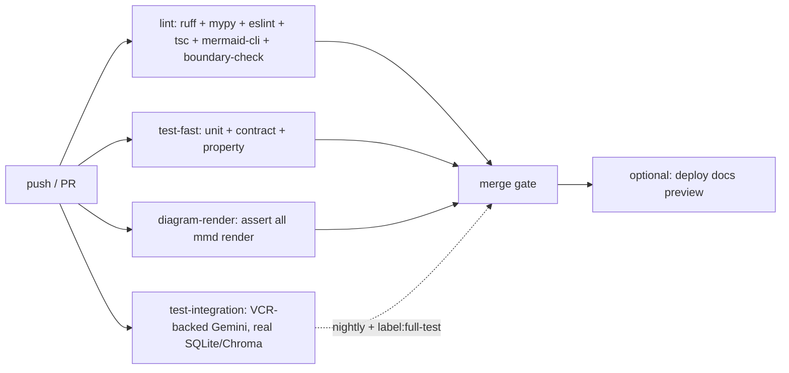

# DraftLoop — Phase 07: Platform — Testing, Scripts, Deployment, Monorepo

| Field         | Value                                                  |
| ------------- | ------------------------------------------------------ |
| Workspace     | repo root + `docker-compose.yml` + CI                  |
| Rubric weight | §5 Code Quality & System Design — 10 + §6 Documentation & Clarity — 5 |
| Depends on    | nothing; the substrate everything else runs on         |
| Status        | Approved                                               |

## 1. Goal

Establish the substrate: how the project is run, tested, deployed; how the
modularity rule is **enforced**, not just stated; how the reviewer goes from
fresh clone to a working draft in under 10 minutes.

## 2. Test pyramid



**Layer rules:**

- **Unit** (`pytest`, no I/O) — every module in `packages/*`. Target ≥80%
  line coverage in `packages/`, ≥60% in `apps/`.
- **Property** (`hypothesis`) — invariants:
  - `Chunk.text == ingest.markdown[c.char_start:c.char_end]`
  - `Citation.quote in chunk.text`
  - `RRF(any_rankings)` is a valid permutation
  - `EditEvent.before != after`
- **Contract** — Pydantic models JSON round-trip; OpenAPI (auto-generated
  from FastAPI) matches TS types in `packages/ui/src/types`; CI fails on drift.
- **Integration** (`pytest-asyncio` + real SQLite/Chroma in tmpdirs + VCR
  cassettes for Gemini) — multi-package flows. No mocks of our own code; the
  network boundary is recorded.
- **E2E** (Playwright + pytest-docker) — `docker compose up` against synthetic
  corpus, scripted user journeys.

Coverage gate: PR fails if `packages/` coverage drops > 2 pp from `main`.

### Where tests live

```
packages/<pkg>/tests/         # unit + property for that package
tests/integration/            # multi-package; real SQLite/Chroma in tmpdir
tests/contract/               # OpenAPI <-> TS schema, Pydantic round-trips
tests/e2e/                    # Playwright; brings up docker compose
apps/web/tests/               # Vitest + Testing Library for React
data/cassettes/               # VCR fixtures, committed; refreshed explicitly
```

## 3. `scripts/` — operator/reviewer command surface

Every script idempotent, `--help`, structured logs.

| Script | Purpose |
|---|---|
| `scripts/setup.sh` | One-shot: install `uv`, sync workspace, install `pnpm`, install Playwright browsers, download HHEM weights |
| `scripts/dev.sh` | Dev stack: `apps/api` (uvicorn reload) + `apps/web` (next dev) in one pane via `concurrently` |
| `scripts/build_synthetic_corpus.py` | Generate 12-doc corpus into `data/synthetic/` |
| `scripts/build_golden_qa.py` | Flash-draft + review-queue Q/A set; writes `data/golden/qa_v<ver>.json` |
| `scripts/seed_demo.py` | Ingest synthetic corpus, generate a draft, plant 1 week of edits — fully-loaded demo in one command |
| `scripts/eval.sh` | Full eval harness; writes `docs/eval-reports/YYYY-MM-DD/`. `--offline`, `--suite=`, `--cost-budget=` flags |
| `scripts/eval_diff.py` | Diff two reports (PR descriptions) |
| `scripts/run_ingest_demo.py` | One-PDF demo: prints OCR Markdown + confidence heatmap |
| `scripts/replay_week.py N` | Force-run `ReplayHarness` for week N (debugging the edit loop) |
| `scripts/refresh_cassettes.py` | Interactive cassette refresh (requires `--confirm-spend`) |
| `scripts/lint.sh` | `ruff check` + `ruff format --check` + `mypy --strict packages/` + `pnpm lint` + `pnpm typecheck` + `mermaid-cli` |
| `scripts/check_boundaries.py` | Lint cross-package imports (Python); fails on `_internal` access |
| `scripts/check_boundaries.mjs` | Same for `packages/ui` |
| `scripts/check_diagrams.sh` | Validates every `.mmd` and fenced `mermaid` block via `mmdc` |

## 4. Deployment topology



Reviewer flow:

```
git clone …
cp .env.example .env                  # drop in GEMINI_API_KEY
docker compose up --build             # builds + boots + seeds (SEED_ON_BOOT=true)
open http://localhost:3000            # demo draft is one click away
```

**Production swap path** (designed for, not built now):

- `STORE=postgres` → `DocumentStore` → Postgres
- `VECTOR_STORE=qdrant` → `VectorIndex` → Qdrant container in compose profile `prod`
- `BLOB_STORE=s3` → `BlobStore` → S3

All swaps config-driven; no source changes.

### `.env.example`

```
GEMINI_API_KEY=
DRAFTER_MODEL=gemini-2.5-pro
DRAFTER_MODE=single_call
EXTRACTION_MODEL=gemini-2.5-flash
EMBED_MODEL=gemini-embedding-001
EMBED_DIM=1536
CRITIC_ENABLED=true
CRITIC_AUTO_APPLY=false
SEED_ON_BOOT=true
EVAL_COST_BUDGET_USD=2
STORE=sqlite
VECTOR_STORE=chroma
BLOB_STORE=local
LANGFUSE_HOST=
LOG_LEVEL=INFO
PORT_API=8000
PORT_WEB=3000
```

## 5. Monorepo tooling

- **Python workspace**: `uv` workspaces (`[tool.uv.workspace]` at root).
  Each `packages/*` and `apps/api` is its own package. `uv sync` builds the
  lock; `uv run` invokes scripts.
- **JS workspace**: `pnpm` workspaces (`pnpm-workspace.yaml`). `apps/web` +
  `packages/ui`.
- **Task runner**: `turbo` (`turbo.json`) coordinates both stacks:
  - `turbo build` — builds `apps/web`, `packages/ui` (tsup)
  - `turbo lint` — both stacks
  - `turbo test` — unit + contract (fast lane)
  - `turbo test:integration` — integration + e2e (slow lane)
- **Quality gates**: `ruff` (format + lint), `mypy --strict` for packages,
  `eslint` + `tsc --noEmit` for JS, `markdownlint` for docs, `mermaid-cli`
  validates every diagram.

## 6. CI pipeline



Fast lane (lint + test-fast + diagrams + cost-budget) blocks merge.
Integration runs nightly + on PRs with the `full-test` label.

## 7. Boundary lint

`scripts/check_boundaries.py` parses every `.py` under `packages/` via `ast`,
walks `Import` / `ImportFrom`, and fails if:

- any package imports from another's `internal/` submodule
- any package imports from `apps/`
- any package imports `from google import genai` directly (must go through
  `draftloop_core.llm`)

Mirror script for JS: `scripts/check_boundaries.mjs` against
`packages/ui/src/internal/` and against any direct fetch to Gemini.

Escape hatch: inline `# boundary: allow <reason>` comment, with the reason
recorded in the PR description.

## 8. Observability

- All LLM calls funnel through `draftloop_core.llm` — emits OTel span (model,
  tokens, latency, cache hit, prompt hash, cost) to stdout exporter by default.
- `LANGFUSE_HOST` env opts in to Langfuse trace exporter.
- `/metrics` exposes Prometheus-format counters (drafts, ingest jobs,
  classifier latency, replay duration) for the optional `--profile=prod`
  compose stack.
- Every drafting run emits `audit_trail.json` (spec'd in Phase 03).

## 9. Tests for this phase

- **Setup**: GitHub Actions matrix runs `scripts/setup.sh` on `ubuntu-latest`
  + `macos-latest`; asserts `scripts/dev.sh` boots and `/health` returns 200 in ≤60s.
- **Boundary lint**: planted-violation fixture imports `_internal` → must fail.
- **Docker**: build, `compose up`, hit `/health`, hit `/metrics`, run
  `scripts/seed_demo.py`, assert `/api/matters` returns a seeded draft.
- **Cassette freshness**: CI fails if any cassette > 90 days old (forces
  periodic real-Gemini refresh).
- **Diagram render**: every `*.mmd` and every fenced `mermaid` block in
  `docs/` passes `mmdc` validation.

## 10. Failure modes & mitigation

| Failure | Mitigation |
|---|---|
| No Docker on reviewer machine | `scripts/setup.sh --no-docker` installs Python+Node via `uv` + `volta` |
| HHEM download blocked by firewall | Init container caches once; `--no-hhem` mode degrades verification to substring + Flash-judge only |
| Boundary lint blocks legitimate refactor | `# boundary: allow <reason>` inline + PR description note |
| Diagrams render locally but fail CI (puppeteer fonts) | Pin `mermaid-cli`; CI Dockerfile fragment provides required fonts |
| Compose can't bind port 3000/8000 | `PORT_API`/`PORT_WEB` env override; documented in README troubleshooting |
| Slow tests dominate the PR loop | Two-lane CI (fast gates merge; slow gates nightly); coverage flag on slow lane avoids double count |
| Reviewer skips README | Top of README: 5-line *Quick start* + screenshot of editor + link to eval scorecard. Everything else below. |

## 11. Open decisions deferred to implementation

- Dockerfile base image: `python:3.12-slim` vs `mambaorg/micromamba` (proposed: slim + uv)
- `apscheduler` vs cron container for nightly batches (proposed: apscheduler)
- README screenshot: editor or eval scorecard (proposed: editor screenshot, eval scorecard link below)

## 12. Cross-references

- Overview: `2026-05-15-00-overview-design.md`
- Project-root contributor contract: `CLAUDE.md`
- CI configuration: `.github/workflows/ci.yml` (implementation phase)
- Compose definition: `docker-compose.yml` (implementation phase)
